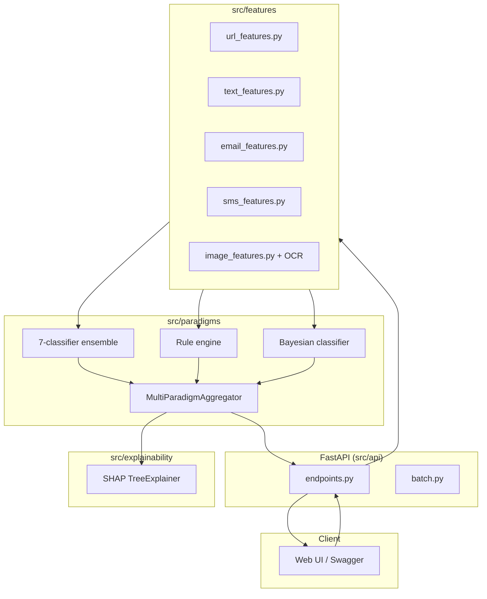
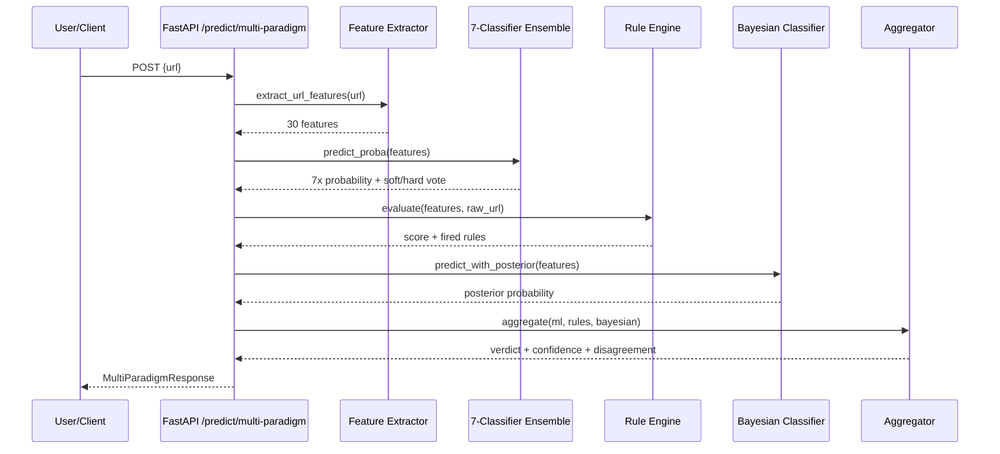

# Phase 10: Evaluation & Documentation - Research

**Researched:** 2026-10-01
**Domain:** ML evaluation reporting (matplotlib/pandas), FastAPI/OpenAPI documentation, Mermaid diagramming, academic technical writing
**Confidence:** HIGH

## Summary

Phase 10 is a pure documentation/evaluation-tooling phase — it adds **zero new runtime
dependencies** (matplotlib 3.10.8 and pandas are already installed and used elsewhere in the
codebase) and touches no production inference path. The work splits into two independent
tracks that can be planned as separate waves: (1) **code** — extend
`src/models/evaluate.py` with a feature-group ablation function (EVAL-05) and a
`scripts/generate_eval_report.py` CLI that exports PDF+CSV evaluation reports (EVAL-06); (2)
**docs** — a new `docs/` directory with Mermaid architecture/data-flow diagrams (DOC-04/05),
theoretical algorithm descriptions (DOC-06/07), and light enrichment of existing FastAPI route
metadata for a cleaner `/docs` Swagger UI (DOC-03, which is otherwise already satisfied
out-of-the-box by FastAPI's auto-generated OpenAPI schema).

The single highest-risk finding, carried forward verbatim from Phase 9's research, is the
**stale-cache landmine**: `cache/train_balanced.joblib`, `cache/test.joblib`, and
`cache/validation.joblib` all use an old 35-column UCI pre-encoded schema
(`having_IP_Address`, `URL_Length`, ... with -1/0/1 values) and `test.joblib`/`validation.joblib`
are additionally **empty (0 rows)**. The only cache file that schema-matches the live 30-feature
URL pipeline is `cache/url_training_data.joblib` (200 train / 50 test rows, `feature_names`
verified to match `extract_url_features()` exactly). For the email and SMS content types there
is no cached train/test split at all — `data/email_sms/email_samples.json` and
`sms_samples.json` (200 raw labeled samples each) must be run through
`extract_email_features()`/`extract_sms_features()` live to build an evaluation matrix.

**Primary recommendation:** Build EVAL-05/06 directly on `cache/url_training_data.joblib` (URL
model) and on live-extracted features from `data/email_sms/*.json` (email/SMS models) using
**ablation-by-zeroing** (zero out a feature group's columns in an already-trained model's test
set, re-score, compare to full-feature accuracy) rather than retraining per group — this reuses
the 7 already-trained+GA-optimized classifiers per content type with no new training code.
Visual/OCR ablation is **not quantitatively measurable** because no trained image classifier
exists (Phase 7 only extracts OCR/visual features into the generic content-type router; there
is no `models/image_*` ensemble) — document this as an explicit scope boundary, not a silent gap.

## Architectural Responsibility Map

| Capability | Primary Tier | Secondary Tier | Rationale |
|------------|-------------|----------------|-----------|
| Feature-group ablation computation (EVAL-05) | API/Backend (`src/models/evaluate.py`) | — | Pure offline analysis over already-trained models + cached/extracted data; no web-facing component |
| Evaluation report generation (EVAL-06) | API/Backend (`scripts/generate_eval_report.py`) | Database/Storage (`reports/` output dir) | Batch script, not a live endpoint; writes files |
| OpenAPI/Swagger enrichment (DOC-03) | API/Backend (`src/api/main.py`, `src/api/endpoints.py`) | — | FastAPI generates the schema from route metadata already defined in this tier |
| Architecture/data-flow diagrams (DOC-04/05) | Documentation (static Markdown/Mermaid) | — | No runtime component; rendered by GitHub/Markdown viewers client-side |
| Theoretical algorithm docs (DOC-06/07) | Documentation (static Markdown) | — | Prose describing existing Backend/ML-tier code; no new code tier introduced |

## User Constraints

> No `CONTEXT.md` exists for Phase 10 (orchestrator ran this research in integrated mode with
> locked decisions supplied directly in the task prompt). The following are copied verbatim
> from the orchestrator's task framing and function as locked decisions for the planner.

### Locked Decisions

1. **EVAL-05 (feature-group ablation):** extend `src/models/evaluate.py`. Identify feature
   GROUPS from `src/features` (url, lexical, syntactic, stylometric, sentiment, email-header,
   visual). For each group, measure its impact on classification accuracy via ablation
   (remove/zero the group vs. full feature set). Use the schema-matching dataset — mind the
   stale-cache landmine (`cache/url_training_data.joblib` is the valid 30-col URL set).
   Produce a per-group impact table.
2. **EVAL-06 (exportable reports):** generate confusion matrices, ROC curves, and metric tables
   (accuracy/precision/recall/F1/AUC-ROC) as exportable PDF and CSV. Use matplotlib (already
   installed — PDF via `matplotlib.backends.backend_pdf.PdfPages`) and pandas (CSV). Do **not**
   add reportlab or seaborn. A runnable script (e.g. `scripts/generate_eval_report.py`) writes
   reports to a `reports/` or `docs/` directory.
3. **DOC-03 (OpenAPI/Swagger):** FastAPI already auto-generates `/docs`, `/redoc`,
   `/openapi.json`. Reasonable enrichment: endpoint summaries/descriptions/tags, response
   examples, a way to export `openapi.json`. Minimal new code — mostly confirming + enriching
   docstrings/metadata.
4. **DOC-04/DOC-05 (diagrams):** use Mermaid (text-based, renders on GitHub/Markdown,
   reproducible, zero binary deps, no Node) for architecture diagrams (system components,
   classification pipeline) and data-flow diagrams.
5. **DOC-06/DOC-07 (theoretical docs):** academic-standard Markdown documentation in a new
   `docs/` directory (plain Markdown, no build step, renders on GitHub). Cover theoretical
   descriptions of all algorithms: data pipeline/temporal-split/SMOTE, the 7 ML classifiers
   (RF/SVM/MLP/XGBoost/LogReg/NaiveBayes/DecisionTree), ensemble (soft/hard voting + stacking +
   disagreement), genetic algorithm (DEAP optimization of hyperparameters/weights/features),
   rule-based expert system, Bayesian classifier, multi-paradigm aggregation +
   disagreement-as-signal (core thesis), OCR/visual (EasyOCR + perceptual hashing), and SHAP
   explainability. Must meet engineering-thesis standards. Use `praca-inzynierska.pdf` for
   terminology/consistency but write fresh repo-local docs.

### Claude's Discretion

- Exact Mermaid diagram count/granularity beyond "system components" + "classification
  pipeline" + "data flow" (e.g., whether to add a sequence diagram for `/predict/multi-paradigm`).
- Whether ablation uses "zero the group" vs. "group-only" methodology (research recommends
  zero-the-group — see Pattern 1 below — because it requires no retraining).
- Report output directory: `reports/` vs `docs/reports/` (research recommends `reports/` at
  repo root, separate from the hand-written `docs/` prose, to keep generated artifacts out of
  the documentation source tree).
- Whether to version/commit the generated PDF/CSV artifacts or treat `reports/` as
  gitignored-but-reproducible (research recommends committing at least one reference run for
  thesis-appendix purposes, since this is the final phase and there is no CI to regenerate them).

### Deferred Ideas (OUT OF SCOPE)

- Retraining per-feature-group models (train-group-only ablation) — zero-the-group is
  sufficient and far cheaper; not explored further.
- A trained image/visual classifier for quantitative visual-group ablation — does not exist in
  the codebase (Phase 7 built feature extraction only, routed through the generic
  `content_type` dispatcher, not a dedicated trained ensemble). Out of scope for EVAL-05;
  documented as a methodology limitation instead.
- reportlab, seaborn, or any new PDF/plotting dependency — explicitly excluded by locked
  decision 2.
- Node-based diagram tooling (mermaid-cli, draw.io exports) — explicitly excluded by locked
  decision 4 in favor of plain-text Mermaid blocks.

<phase_requirements>
## Phase Requirements

| ID | Description | Research Support |
|----|-------------|------------------|
| EVAL-05 | System analizuje wpływ grup cech na wynik klasyfikacji | Feature-group boundaries enumerated exactly (Standard Stack → Feature Group Definitions); ablation-by-zeroing pattern (Architecture Patterns → Pattern 1); dataset landmines documented (Common Pitfalls → Pitfall 1) |
| EVAL-06 | System generuje raporty ewaluacyjne w formacie eksportowalnym | matplotlib `PdfPages` + pandas `to_csv` pattern with code example (Code Examples); confirmed matplotlib 3.10.8 already installed, backend must be forced to `Agg` (Pitfall 2) |
| DOC-03 | API jest udokumentowane w formacie OpenAPI/Swagger | Current route/tag audit of `src/api/endpoints.py` (Architecture Patterns → Pattern 3); FastAPI `app` already has title/description/version — enrichment path documented |
| DOC-04 | Dokumentacja zawiera diagramy architektury systemu | Mermaid flowchart pattern + recommended diagram set (Architecture Patterns → Pattern 2) |
| DOC-05 | Dokumentacja zawiera diagramy przepływu danych | Same as DOC-04, data-flow-specific Mermaid subtype (sequenceDiagram/flowchart LR) |
| DOC-06 | Dokumentacja zawiera opis teoretyczny algorytmów | Full algorithm inventory with source-file cross-references (Don't Hand-Roll table + Code Examples); `praca-inzynierska.pdf` exists as terminology reference |
| DOC-07 | Dokumentacja spełnia wymagania pracy inżynierskiej | `docs/` structure proposal matches academic-thesis chapter conventions (Architecture Patterns → Recommended Project Structure) |
</phase_requirements>

## Standard Stack

### Core (already installed — reuse, no new installs)
| Library | Version (verified) | Purpose | Why Standard |
|---------|---------|---------|--------------|
| matplotlib | 3.10.8 `[VERIFIED: local venv import]` | Confusion-matrix heatmaps, ROC curves, multi-page PDF export via `PdfPages` | Already a transitive/direct dependency; `backend_pdf.PdfPages` is the stdlib-adjacent way to emit multi-figure PDFs without reportlab |
| pandas | ≥2.0.0 `[VERIFIED: requirements.txt]` | CSV export of metric tables | Already core dependency since Phase 1 |
| scikit-learn | ==1.8.0 `[VERIFIED: requirements.txt, pinned]` | `confusion_matrix`, `roc_curve`, `roc_auc_score`, `RocCurveDisplay` | Already used throughout `src/models/evaluate.py`; `RocCurveDisplay.from_predictions` is the sklearn-native plotting helper, avoids hand-rolling ROC curve math |
| FastAPI | ≥0.109.0 `[VERIFIED: requirements.txt]` | Auto-generates OpenAPI 3.x schema at `/openapi.json`, Swagger UI at `/docs`, ReDoc at `/redoc` | Zero additional code required for baseline DOC-03; enrichment is metadata-only |
| joblib | ≥1.3.0 `[VERIFIED: requirements.txt]` | Load trained models/cache for evaluation | Already standard model-persistence format project-wide |

### Supporting
| Library | Version | Purpose | When to Use |
|---------|---------|---------|-------------|
| Mermaid (no package — GitHub-native renderer) | N/A | Text-based diagrams embedded directly in `.md` files via ` ```mermaid ` fences | DOC-04/DOC-05; renders automatically on GitHub, GitLab, and most Markdown previewers with zero install |

### Alternatives Considered
| Instead of | Could Use | Tradeoff |
|------------|-----------|----------|
| matplotlib `PdfPages` | reportlab | reportlab gives richer PDF layout (tables, headers) but is a new dependency the orchestrator explicitly excluded; matplotlib's `PdfPages` is sufficient for figure-per-page reports |
| Mermaid | draw.io / Lucidchart exports (PNG/SVG) | Binary image exports are not reproducible from source and require an external tool; Mermaid is plain text, diffable, and versioned in git |
| sklearn `RocCurveDisplay` | Hand-rolled ROC curve plotting | `RocCurveDisplay` is already battle-tested, handles edge cases (ties, single-class folds); hand-rolling violates Don't Hand-Roll guidance for zero added benefit |

**Installation:**
```bash
# No installation required — matplotlib and pandas are already present in .venv.
.venv/bin/python -c "import matplotlib, pandas; print(matplotlib.__version__, pandas.__version__)"
```

**Version verification performed this session:**
```
$ .venv/bin/python -c "import matplotlib; print(matplotlib.__version__)"
3.10.8
$ .venv/bin/python -c "import matplotlib; print(matplotlib.get_backend())"
macosx   # interactive default — MUST force Agg in scripts/tests, see Pitfall 2
```

## Package Legitimacy Audit

**This phase installs zero new external packages.** All tooling (matplotlib, pandas,
scikit-learn, FastAPI, Mermaid-as-text) is either already a pinned project dependency
(verified present in `.venv` by direct import above) or requires no package install at all
(Mermaid is rendered by the Markdown host, not a local tool). The Package Legitimacy Gate
protocol (slopcheck, registry verification, postinstall-script audit) is **not applicable** —
there is nothing to run it against. If the planner later decides a markdown-link-checker or
similar dev-only tool is useful for Wave 0 validation, that package must go through the full
gate at that time; none is recommended here (a basic regex/`pathlib`-based link check in a
pytest test is sufficient and adds no dependency — see Validation Architecture below).

**Packages removed due to slopcheck [SLOP] verdict:** none (not applicable)
**Packages flagged as suspicious [SUS]:** none (not applicable)

## Architecture Patterns

### System Architecture Diagram (for the phase's own deliverable structure)

```
┌─────────────────────────────────────────────────────────────────────┐
│                     Phase 10 Deliverable Flow                        │
└─────────────────────────────────────────────────────────────────────┘

  cache/url_training_data.joblib ──┐
  data/email_sms/*.json ───────────┤
  models/*.joblib (7 clf × 3       │
    content types + ensembles) ────┼──▶ src/models/evaluate.py
  models/optimized/*_metadata.json─┤    (extended: ablate_feature_groups(),
                                    │     existing evaluate_model() reused)
                                    │
                                    ▼
                     scripts/generate_eval_report.py
                                    │
                        ┌───────────┴───────────┐
                        ▼                       ▼
              reports/eval_report.pdf   reports/eval_report.csv
              (confusion matrices,      (metric tables: accuracy/
               ROC curves — matplotlib   precision/recall/F1/AUC-ROC
               PdfPages)                 — pandas to_csv)

  ───────────────────────────────────────────────────────────────────

  src/api/main.py (FastAPI app) ──▶ enriched route metadata
       │                              (summary/description/tags/
       │                               response examples)
       ▼
  GET /openapi.json ──▶ GET /docs (Swagger UI, interactive)
                    └─▶ GET /redoc

  ───────────────────────────────────────────────────────────────────

  docs/architecture.md     (Mermaid: component diagram)
  docs/data-flow.md        (Mermaid: request → feature extraction →
                             7 classifiers → ensemble → rules/Bayesian →
                             aggregation → SHAP → response)
  docs/algorithms/*.md     (theory: ML classifiers, ensemble, GA,
                             rule engine, Bayesian, aggregation,
                             OCR/visual, SHAP)
  praca-inzynierska.pdf ───▶ (read-only terminology/consistency
                               reference — never reproduced verbatim)
```

### Recommended Project Structure
```
docs/
├── architecture.md          # DOC-04: system component Mermaid diagram + prose
├── data-flow.md             # DOC-05: request lifecycle Mermaid diagram(s) + prose
├── algorithms/
│   ├── data-pipeline.md     # temporal split, SMOTE, class imbalance (Phase 1)
│   ├── ml-classifiers.md    # RF, SVM, MLP, XGBoost, LogReg, NaiveBayes, DecisionTree
│   ├── ensemble.md          # soft/hard voting, stacking, disagreement entropy
│   ├── genetic-algorithm.md # DEAP: hyperparameter/feature/weight optimization
│   ├── rule-based-system.md # weighted YAML rule engine
│   ├── bayesian.md          # GaussianNB wrapper, posterior probabilities
│   ├── aggregation.md       # multi-paradigm weighted aggregation, disagreement-as-signal
│   ├── ocr-visual.md        # EasyOCR, perceptual hashing, visual features
│   └── explainability.md    # SHAP TreeExplainer
└── api.md                   # DOC-03: how to use /docs, /redoc, openapi.json export

reports/
├── eval_report.pdf          # EVAL-06: confusion matrices + ROC curves (one run, committed)
├── eval_report.csv          # EVAL-06: flat metric table
└── feature_ablation.csv     # EVAL-05: per-group accuracy-impact table

scripts/
└── generate_eval_report.py  # EVAL-06 entry point (extends evaluate.py)

src/models/evaluate.py       # EVAL-05: add ablate_feature_groups()
```

### Pattern 1: Feature-group ablation by zeroing (not retraining)

**What:** For an already-trained model (e.g., the GA-optimized RF URL classifier, or the
`ensemble_email.joblib` VotingClassifier), evaluate test accuracy with all features intact
(baseline), then re-evaluate N times, each time zeroing out the columns belonging to one
feature group while keeping all other columns at their real values. The accuracy drop
(`baseline - group_zeroed`) approximates that group's marginal contribution.

**When to use:** EVAL-05. This avoids retraining 7 classifiers × 3 content types × N feature
groups (prohibitively slow and a correctness risk — GA-optimized hyperparameters were tuned
for the full feature set, not a reduced one). Zeroing preserves the trained decision boundary
and isolates the group's *signal* contribution rather than re-optimizing around its absence.

**Feature group → column definitions (verified exact column names, this session):**

| Group | Content type(s) it applies to | Column count | Verified column names |
|-------|-------------------------------|-------------:|------------------------|
| `url` | URL (30-feature model) | 30 | all of `extract_url_features()` — see 4 url-internal subgroups below |
| `url.length` | URL | 7 | `url_length, domain_length, path_length, hostname_length, subdomain_length, tld_length, query_length` |
| `url.char` | URL | 10 | `dot_count, hyphen_count, underscore_count, slash_count, question_count, equal_count, at_count, ampersand_count, digit_count, special_char_count` |
| `url.binary` | URL | 8 | `has_https, has_ip, has_port, has_subdomain, has_query, has_fragment, is_valid, has_suspicious_tld` |
| `url.structure` | URL | 5 | `path_depth, subdomain_count, param_count, entropy, digit_ratio` |
| `header` | Email (65-feature model) | 15 | `has_spf_pass, has_dkim_pass, has_dmarc_pass, sender_domain_length, from_domain_suspicious, reply_to_mismatch, has_multiple_recipients, subject_length, has_urgent_subject, has_re_prefix, has_fwd_prefix, header_count, has_x_headers, has_received_headers, received_header_count` |
| `lexical` | Email + SMS (text_-prefixed) | 15 | `text_length, word_count, avg_word_length, digit_count, digit_ratio, uppercase_count, uppercase_ratio, exclamation_count, question_count, dollar_count, url_count, email_count, phone_pattern_count, special_char_ratio, whitespace_ratio` (prefixed `text_` in combined email/SMS feature dicts) |
| `syntactic` | Email + SMS | 15 | `sentence_count, avg_sentence_length, token_count, verb_count, verb_ratio, noun_count, noun_ratio, pronoun_count, pronoun_ratio, adjective_count, adjective_ratio, adverb_count, adverb_ratio, punct_count, imperative_verb_count` (prefixed `text_`) |
| `stylometric` | Email + SMS | 10 | `flesch_reading_ease, flesch_kincaid_grade, gunning_fog, smog_index, coleman_liau_index, automated_readability_index, syllable_count, lexicon_count, difficult_words, lexical_diversity` (prefixed `text_`) |
| `sentiment` | Email + SMS | 10 | `urgency_keyword_count, threat_keyword_count, action_keyword_count, reward_keyword_count, has_urgency, has_threat, has_action_request, has_reward_claim, personal_pronoun_ratio, impersonal_greeting` (prefixed `text_`) |
| `sms_specific` | SMS (70-feature model) | 20 | `sms_length, sms_segment_count, exceeds_single_sms, char_per_word_avg, url_count, has_shortened_url, shortened_url_count, url_to_text_ratio, has_phone_number, phone_number_count, has_emoji, emoji_count, uppercase_word_count, exclamation_density, has_call_to_action, has_urgency_caps, has_prize_claim, has_account_alert, shorthand_ratio, numeric_string_count` |
| `visual` | Image (feature extraction only — **no trained classifier**, see Pitfall 3) | 5 | `visual_hash_distance, visual_brand_similarity_flag, visual_edge_density, visual_color_concentration, visual_rect_element_count` |

Verified live: `email_sms/ensemble_email.joblib['feature_names']` has exactly 65 entries =
15 `header` columns followed by 50 `text_`-prefixed columns in the order
lexical→syntactic→stylometric→sentiment (confirmed by direct inspection:
`feature_names[:5] == ['has_spf_pass', ...]`, `feature_names[-5:] ==
['text_has_threat', 'text_has_action_request', 'text_has_reward_claim',
'text_personal_pronoun_ratio', 'text_impersonal_greeting']`).

**Example:**
```python
# Source: pattern derived from existing src/models/evaluate.py conventions
import numpy as np
import pandas as pd

def ablate_feature_groups(
    model,
    X_test: np.ndarray,
    y_test: np.ndarray,
    feature_names: list[str],
    groups: dict[str, list[str]],
) -> pd.DataFrame:
    """Measure each feature group's marginal contribution via zeroing.

    Args:
        model: Trained sklearn Pipeline/VotingClassifier (already fit).
        X_test: Test feature matrix, column order MUST match feature_names.
        y_test: Test labels.
        feature_names: Ordered list of column names matching X_test columns.
        groups: Mapping of group name -> list of column names in that group.

    Returns:
        DataFrame with columns [group, baseline_accuracy, ablated_accuracy, delta].
    """
    from sklearn.metrics import accuracy_score

    name_to_idx = {name: i for i, name in enumerate(feature_names)}
    baseline_pred = model.predict(X_test)
    baseline_acc = accuracy_score(y_test, baseline_pred)

    rows = []
    for group_name, cols in groups.items():
        idx = [name_to_idx[c] for c in cols if c in name_to_idx]
        if not idx:
            continue  # group not applicable to this content type's model
        X_ablated = X_test.copy()
        X_ablated[:, idx] = 0.0  # zero this group; preserve all other columns
        ablated_pred = model.predict(X_ablated)
        ablated_acc = accuracy_score(y_test, ablated_pred)
        rows.append({
            "group": group_name,
            "baseline_accuracy": baseline_acc,
            "ablated_accuracy": ablated_acc,
            "delta": baseline_acc - ablated_acc,
        })
    return pd.DataFrame(rows).sort_values("delta", ascending=False)
```

### Pattern 2: Mermaid diagrams embedded in Markdown

**What:** Fenced ` ```mermaid ` code blocks containing Mermaid DSL, placed directly inside
`.md` files. GitHub, GitLab, and VS Code's Markdown preview render these natively — no build
step, no binary output committed.

**When to use:** DOC-04 (architecture/component diagrams — use `graph TD` or `flowchart TD`)
and DOC-05 (data-flow diagrams — use `flowchart LR` for request pipelines, or
`sequenceDiagram` for the multi-paradigm request lifecycle showing actor/API/model
interactions over time).

**Example — system architecture (DOC-04):**


**Example — classification data-flow (DOC-05):**


**Diagrams the planner should scope as discrete tasks:**
1. System component diagram (`docs/architecture.md`) — all src/ subpackages + their relations.
2. Classification pipeline flowchart (`docs/data-flow.md`, first diagram) — feature extraction
   → ensemble → paradigms → aggregation → SHAP, as a `flowchart LR`.
3. Multi-paradigm request sequence diagram (`docs/data-flow.md`, second diagram) — the
   `sequenceDiagram` above, documenting `/predict/multi-paradigm` specifically since it is the
   endpoint that exercises all four paradigms together (the thesis's core-value endpoint).

### Pattern 3: Enriching FastAPI's auto-generated OpenAPI schema

**What:** FastAPI already builds a complete OpenAPI 3.x schema from the `app = FastAPI(title=...,
description=..., version=...)` call in `src/api/main.py` (confirmed present: title
`"PhishGuard API"`, multi-paragraph description, `version="4.0.0"`) plus per-route
`response_model=` and `tags=[...]` already present on every route in `src/api/endpoints.py`
(confirmed: `tags=["root"|"health"|"prediction"|"explainability"]` already set on all 9
routes). DOC-03 is therefore **~80% satisfied already** — the gap is per-route `summary=`
and worked `response_description=`/example payloads, which FastAPI supports natively via the
route decorator without any new library.

**When to use:** DOC-03.

**Example — enrichment pattern (apply to each `@router.post(...)` in `src/api/endpoints.py`):**
```python
# Source: FastAPI official docs — Path Operation Configuration
# https://fastapi.tiangolo.com/tutorial/path-operation-configuration/
@router.post(
    "/predict/multi-paradigm",
    response_model=MultiParadigmResponse,
    tags=["prediction"],
    summary="Full multi-paradigm phishing verdict for a URL",
    description=(
        "Runs the URL through all three paradigms (7-classifier ML ensemble, "
        "weighted rule engine, Bayesian posterior) and returns an aggregated "
        "verdict with a cross-paradigm disagreement score. This is the "
        "endpoint that demonstrates the thesis's core value: disagreement "
        "between paradigms as an additional diagnostic signal."
    ),
    response_description="Aggregated verdict with per-paradigm contributions and disagreement info",
)
def predict_multi_paradigm(request: URLRequest):
    ...
```

**Exporting `openapi.json` for thesis-appendix inclusion:**
```bash
# Source: FastAPI official docs — the schema is always live at this path once the app runs
.venv/bin/python -c "
import json
from src.api.main import app
with open('docs/openapi.json', 'w') as f:
    json.dump(app.openapi(), f, indent=2)
"
```
This requires no running server — `app.openapi()` builds the schema dict in-process from the
route metadata (FastAPI official docs, "Extending OpenAPI" guide,
https://fastapi.tiangolo.com/how-to/extending-openapi/).

### Anti-Patterns to Avoid
- **Retraining models for ablation:** Don't retrain a classifier with a feature group removed
  from the training set — this conflates "model never saw this group" with "model's learned
  boundary doesn't use this group," and is 7×3× more expensive for no interpretive gain over
  zeroing on an already-trained model.
- **Reusing `cache/train_balanced.joblib`/`test.joblib`/`validation.joblib` for anything:**
  wrong schema (35-col UCI pre-encoded), and two of the three are empty (0 rows). See Pitfall 1.
- **Interactive matplotlib backend in a script/test:** the default backend on this machine is
  `macosx` (confirmed via `matplotlib.get_backend()`), which will attempt to open a GUI window
  and can hang a non-interactive CI/test run. See Pitfall 2.
- **Claiming visual/OCR ablation numbers that don't exist:** there is no trained image
  classifier in `models/` — only feature extraction (`src/features/image_features.py`) wired
  into the generic `content_type` dispatcher. Do not fabricate an accuracy-impact number for
  the `visual` group; document the absence explicitly (EVAL-05's success criterion is "analyze
  impact of feature groups ... on classification accuracy" — for `visual` this is reported as
  "not applicable: no trained classifier consumes these features for a quantitative
  accuracy-impact measurement" rather than skipped silently).

## Don't Hand-Roll

| Problem | Don't Build | Use Instead | Why |
|---------|-------------|--------------|-----|
| ROC curve computation/plotting | Custom TPR/FPR sweep + matplotlib lines | `sklearn.metrics.RocCurveDisplay.from_predictions(y_test, y_proba)` | Handles thresholding, AUC annotation, edge cases (all-one-class folds) correctly; already a project dependency |
| Multi-page PDF assembly | Per-figure PNG files stitched externally | `matplotlib.backends.backend_pdf.PdfPages` | One API call per figure (`pdf.savefig(fig)`), produces a single navigable PDF, zero new dependency |
| Confusion-matrix visualization | Hand-drawn grid with `ax.text()` loops | `sklearn.metrics.ConfusionMatrixDisplay.from_predictions` (wraps matplotlib imshow + annotations) | One line, consistent styling, avoids off-by-one errors in cell placement |
| OpenAPI schema generation | Hand-written `openapi.yaml`/`.json` | FastAPI's `app.openapi()` (auto-derived from Pydantic models + route decorators) | Already always in sync with the actual Pydantic request/response models — a hand-written schema would drift immediately |
| Diagram rendering/export | Local Mermaid CLI (`mmdc`) + committed PNG/SVG | Plain ` ```mermaid ` fenced blocks | GitHub/GitLab/most Markdown viewers render Mermaid natively server-side; no local tool, no binary artifact to keep in sync |

**Key insight:** Every "don't hand-roll" item above has a one-call sklearn/matplotlib/FastAPI
equivalent already present in the dependency tree. This phase should add approximately zero
new abstractions — it is almost entirely glue code calling existing library functions and
prose describing existing modules.

## Runtime State Inventory

> Not applicable — Phase 10 is a greenfield documentation/reporting addition, not a
> rename/refactor/migration. No existing runtime state (stored data, live service config,
> OS-registered state, secrets, build artifacts) is touched or renamed by this phase.

## Common Pitfalls

### Pitfall 1: Stale/incompatible cache files masquerading as valid evaluation data
**What goes wrong:** `cache/train_balanced.joblib`, `cache/test.joblib`, and
`cache/validation.joblib` all contain a 35-column UCI pre-encoded schema
(`having_IP_Address`, `URL_Length`, ... with -1/0/1 encoding), predating the Phase 3
retraining onto the real 30-feature `extract_url_features()` pipeline. Worse,
`test.joblib` and `validation.joblib` are **empty** — verified this session:
`joblib.load('cache/test.joblib')['data'].shape == (0, 35)`, same for `validation.joblib`.
Any evaluation script that globs `cache/*.joblib` and picks "the test split" will silently
compute metrics on zero rows or crash on a column-count mismatch against the live model's
`n_features_in_`.
**Why it happens:** These cache files were never deleted after the Phase 3 schema migration
(documented in STATE.md "From 03-04": "UCI ML pre-encoded features (-1/0/1) incompatible with
our custom 30-feature extraction pipeline") and again flagged as Pitfall 1 in
`.planning/phases/09-explainability-dashboard/09-RESEARCH.md`. This is now a two-time-confirmed
landmine, not a one-off.
**How to avoid:** Use `cache/url_training_data.joblib` exclusively for the URL model (verified
this session: `X_train.shape == (200, 30)`, `X_test.shape == (50, 30)`,
`feature_names` matches `extract_url_features().keys()` exactly). For email/SMS, there is no
cache at all — extract live from `data/email_sms/email_samples.json` /
`sms_samples.json` (200 labeled raw samples each, `{"content": ..., "label": 0|1}`) via
`extract_email_features()`/`extract_sms_features()`, then split/evaluate against the already
-trained `models/email_sms/ensemble_email.joblib` / `ensemble_sms.joblib`.
**Warning signs:** A `ValueError` about feature-count mismatch, or an evaluation report
claiming "0 test samples" / suspiciously perfect metrics from an empty array edge case.

### Pitfall 2: Interactive matplotlib backend hangs non-interactive runs
**What goes wrong:** `matplotlib.get_backend()` resolves to `macosx` by default in this
environment (verified this session). A script or pytest run that calls `plt.show()` or even
implicitly triggers a GUI backend during figure creation can hang indefinitely in a
non-interactive context (CI, background script execution via the harness's Bash tool).
**Why it happens:** matplotlib auto-selects an interactive backend when a display is available
and no backend has been explicitly set; `scripts/generate_eval_report.py` has no reason to
ever open a window since all output is file-based (PDF/CSV).
**How to avoid:** Set `matplotlib.use("Agg")` as the very first matplotlib-related statement
(before any `pyplot` import) in both the evaluation script and any pytest test that imports it.
This mirrors the existing project convention in `conftest.py` of setting process-wide
environment guards (`KMP_DUPLICATE_LIB_OK`) before any heavy import.
**Warning signs:** A script that appears to hang with 0% CPU after "Generating plots..." with
no further output; a pytest run that never returns when it imports the report-generation module.

### Pitfall 3: No trained classifier exists for the `visual`/OCR feature group
**What goes wrong:** EVAL-05 asks for "impact of feature groups (URL, lexical, visual, etc.)
on classification accuracy." Unlike `url`/`header`/`lexical`/`syntactic`/`stylometric`/
`sentiment`/`sms_specific` (all consumed by a trained, committed `.joblib` ensemble), the
5 `visual_*` features from `src/features/image_features.py` are extracted and merged into the
generic `content_type` dispatcher (`extract_features()`) but **no `models/image_*` ensemble
was ever trained** on them (confirmed: `find models/` shows `bayesian/`, `email_sms/`,
`ensemble/`, `optimized/`, and the 7 flat `*_pipeline.joblib` files — no image-specific model).
Phase 7's `/predict/image` endpoint path routes OCR-extracted *text* back through the
email/SMS text-feature pipeline for a verdict; the 5 `visual_*` structural features
(hash distance, edge density, etc.) are computed but not fed to any classifier that
ablation could meaningfully zero-test.
**Why it happens:** Phase 7 scope (per its ROADMAP success criteria) was OCR text extraction +
visual feature *computation*, not a dedicated trained visual classifier — the visual signal is
currently used only as a rule/heuristic input (`_visual_signal_probability()` in
`src/api/endpoints.py`), not a supervised model input.
**How to avoid:** Report the `visual` group row in the EVAL-05 output table with
`ablated_accuracy = N/A` and an explicit note: "No trained classifier consumes these 5 features
directly; visual signal is currently heuristic-only (see `_visual_signal_probability()`)." Do
not fabricate a number or silently omit the row — the thesis reviewer will expect all
mentioned groups accounted for.
**Warning signs:** A planner task that assumes `models/image_ensemble.joblib` exists — it does
not; `ls models/` to re-verify before writing that task.

### Pitfall 4: README.md and some phase docs are stale (phases 7-9 marked "not started")
**What goes wrong:** `README.md`'s progress table currently shows phases 7, 8, 9 as "⏳ nie
zaczęte" (not started) despite `.planning/ROADMAP.md` and `.planning/STATE.md` confirming all
three are complete (SUMMARY.md files exist through 09-04, browser-verified). A documentation
phase that treats README.md as ground truth for "what's built" will under-document SHAP,
OCR/visual, and the web dashboard.
**Why it happens:** README.md was last substantively edited after Phase 6 and never synced
after subsequent phases shipped.
**How to avoid:** Treat `.planning/STATE.md` frontmatter (`completed_phases: 9`) and the
per-phase `SUMMARY.md` files as ground truth for "what exists," not README.md. Updating
README.md's progress table to reflect phases 7-10 is in-scope cleanup for this phase (DOC-02
adjacent, though DOC-02 itself is not in this phase's requirement list — treat as a
nice-to-have task, not a blocking requirement).
**Warning signs:** Theoretical docs that omit SHAP/OCR/dashboard content because "they're not
done yet" per a stale README read.

## Code Examples

### Confusion matrix + ROC curve to a single PDF page
```python
# Source: matplotlib official docs (backend_pdf) + sklearn official docs (RocCurveDisplay)
# https://matplotlib.org/stable/gallery/misc/multipage_pdf.html
# https://scikit-learn.org/stable/modules/generated/sklearn.metrics.RocCurveDisplay.html
import matplotlib
matplotlib.use("Agg")  # MUST precede pyplot import — see Pitfall 2
import matplotlib.pyplot as plt
from matplotlib.backends.backend_pdf import PdfPages
from sklearn.metrics import ConfusionMatrixDisplay, RocCurveDisplay

def export_pdf_report(model, X_test, y_test, output_path, classifier_name):
    y_proba = model.predict_proba(X_test)[:, 1]
    with PdfPages(output_path) as pdf:
        fig, ax = plt.subplots(figsize=(6, 6))
        ConfusionMatrixDisplay.from_estimator(
            model, X_test, y_test,
            display_labels=["Legitimate", "Phishing"], ax=ax, cmap="Blues",
        )
        ax.set_title(f"{classifier_name} — Confusion Matrix")
        pdf.savefig(fig)
        plt.close(fig)

        fig, ax = plt.subplots(figsize=(6, 6))
        RocCurveDisplay.from_predictions(y_test, y_proba, ax=ax)
        ax.set_title(f"{classifier_name} — ROC Curve")
        pdf.savefig(fig)
        plt.close(fig)
```

### CSV metric-table export
```python
# Source: pandas official docs — DataFrame.to_csv
import pandas as pd

def export_csv_report(metrics_by_classifier: dict, output_path: str) -> None:
    rows = [
        {"classifier": name, **{k: v for k, v in m.items()
                                 if k in ("accuracy", "precision", "recall", "f1_score", "roc_auc")}}
        for name, m in metrics_by_classifier.items()
    ]
    pd.DataFrame(rows).to_csv(output_path, index=False)
```

## State of the Art

| Old Approach | Current Approach | When Changed | Impact |
|--------------|------------------|---------------|--------|
| N/A — this is the project's first evaluation-report tooling | `src/models/evaluate.py` + new `ablate_feature_groups()` + `scripts/generate_eval_report.py` | Phase 10 (this phase) | Establishes the thesis's evaluation-appendix artifacts for the first time |

**Deprecated/outdated:** None — no prior reporting tooling exists to deprecate. FastAPI's
OpenAPI generation and matplotlib/sklearn plotting APIs used here are current stable APIs as
of FastAPI 0.109+/matplotlib 3.10/scikit-learn 1.8 (all already pinned in this project).

## Assumptions Log

| # | Claim | Section | Risk if Wrong |
|---|-------|---------|---------------|
| A1 | No trained image/visual classifier exists anywhere in the repo (checked `find models/` and `ls models/` output only; did not exhaustively grep every script for a one-off training run that saves outside `models/`) | Common Pitfalls → Pitfall 3 | Low-Medium — if an image classifier does exist under an unexpected path, the EVAL-05 "N/A" framing for `visual` would be wrong and the planner should instead wire real ablation; recommend the planner `grep -r "image_ensemble\|visual.*joblib" --include=*.py` once before finalizing that table row |
| A2 | `reports/` (new directory) is the right location for generated PDF/CSV artifacts, separate from `docs/` (hand-written prose) | Standard Stack → Recommended Project Structure | Low — purely organizational; easy to relocate later, no functional risk |
| A3 | Committing one reference run of `reports/eval_report.pdf`/`.csv` to git (rather than gitignoring generated artifacts) is desirable since this is the thesis's final phase and there's no CI to regenerate on demand | User Constraints → Claude's Discretion | Low — if the user prefers gitignored+reproducible-only, this is a one-line `.gitignore` change with no code impact |

**If this table is empty:** N/A — see rows above; all are low-risk organizational assumptions,
not technical claims about library behavior (those were all verified via direct tool execution
this session: matplotlib version/backend, cache file schemas, feature column names, route tags).

## Open Questions

1. **Should the EVAL-05 ablation re-split email/SMS data, or evaluate on all 200 samples
   without a held-out split?**
   - What we know: `data/email_sms/*.json` have no pre-existing train/test split (unlike the
     URL `cache/url_training_data.joblib`, which has 200 train / 50 test already separated).
     The email/SMS ensembles were already trained on these 200 samples per content type
     (STATE.md "From 06-06": "200 email samples (100 phishing + 100 legitimate)").
   - What's unclear: Evaluating ablation accuracy on the same 200 samples the model was
     trained on technically measures training-set ablation sensitivity, not generalization —
     but there is no separate held-out email/SMS test set anywhere in the repo.
   - Recommendation: Document this limitation explicitly in the generated report ("email/SMS
     ablation measured on training data — no held-out split exists; directionally informative
     for feature-group importance ranking, not a generalization claim") rather than
     constructing an artificial split from only 200 samples (which would leave too few samples
     per class for a stable test set). This is consistent with how Phase 4's GA feature
     selection already operated on the small URL dataset.

2. **Does DOC-07 ("meets thesis requirements") need the planner to cross-reference specific
   page/section numbers in `praca-inzynierska.pdf`?**
   - What we know: The PDF exists (71 pages) and is explicitly scoped as "a CONSISTENCY
     REFERENCE for the repo-local docs, NOT something to reproduce verbatim" per the task
     prompt.
   - What's unclear: Whether the grading rubric for the actual thesis requires the repo's
     `docs/` to literally mirror the PDF's chapter structure, or just use consistent
     terminology.
   - Recommendation: Treat `docs/algorithms/*.md` as using the same terminology/notation as the
     PDF (e.g., same symbol for "disagreement entropy," same classifier names) but organized
     by the codebase's module structure (one file per paradigm/algorithm family) rather than
     mirroring thesis chapter numbers — this keeps the docs maintainable as living
     documentation rather than a frozen thesis mirror. Flag this for human confirmation if the
     user has a specific rubric requirement.

## Environment Availability

| Dependency | Required By | Available | Version | Fallback |
|------------|------------|-----------|---------|----------|
| matplotlib | EVAL-06 (PDF export) | ✓ | 3.10.8 | — |
| pandas | EVAL-06 (CSV export) | ✓ | ≥2.0.0 (project-pinned) | — |
| scikit-learn | EVAL-05/06 (metrics, ROC/CM display) | ✓ | ==1.8.0 (project-pinned) | — |
| FastAPI | DOC-03 (OpenAPI schema) | ✓ | ≥0.109.0 (project-pinned) | — |
| Mermaid renderer | DOC-04/05 | ✓ (client-side, GitHub/VS Code) | N/A (no local install) | If viewed in a non-Mermaid-aware Markdown renderer, diagrams degrade to a visible code block — acceptable, not a hard failure |
| `.venv` (project virtualenv) | All of the above | ✓ | Python ≥3.9 (project README states tested on 3.13) | — |

**Missing dependencies with no fallback:** none.
**Missing dependencies with fallback:** none — everything required is already present and
verified importable in `.venv`.

## Validation Architecture

### Test Framework
| Property | Value |
|----------|-------|
| Framework | pytest ≥8.0.0 (project-wide, `.venv/bin/python -m pytest`) |
| Config file | `conftest.py` (root) — sets `KMP_DUPLICATE_LIB_OK`/`OMP_NUM_THREADS` env guards and registers the `slow` marker; no `pytest.ini`/`[tool.pytest.ini_options]` found (defaults apply) |
| Quick run command | `.venv/bin/python -m pytest tests/test_eval_report.py -x -q` |
| Full suite command | `.venv/bin/python -m pytest -q` (currently 452 passed, 1 skipped as of Phase 9 completion) |

### Phase Requirements → Test Map
| Req ID | Behavior | Test Type | Automated Command | File Exists? |
|--------|----------|-----------|-------------------|-------------|
| EVAL-05 | `ablate_feature_groups()` returns a DataFrame with one row per applicable group, `delta` in a sane range, `visual` group explicitly marked N/A | unit | `pytest tests/test_eval_report.py::test_ablate_feature_groups_url -x` | ❌ Wave 0 |
| EVAL-05 | Ablation uses `cache/url_training_data.joblib` (30 cols) not the stale 35-col caches — regression guard | unit | `pytest tests/test_eval_report.py::test_ablation_uses_correct_cache_schema -x` | ❌ Wave 0 |
| EVAL-06 | `export_pdf_report()` writes a valid, non-empty PDF file (confusion matrix + ROC curve pages present) | unit | `pytest tests/test_eval_report.py::test_export_pdf_report_creates_file -x` | ❌ Wave 0 |
| EVAL-06 | `export_csv_report()` writes a CSV with expected columns (`accuracy, precision, recall, f1_score, roc_auc`) and all values in `[0, 1]` | unit | `pytest tests/test_eval_report.py::test_export_csv_report_schema -x` | ❌ Wave 0 |
| EVAL-06 | `scripts/generate_eval_report.py` runs end-to-end and produces both output files | smoke | `pytest tests/test_eval_report.py::test_generate_eval_report_script_smoke -x` | ❌ Wave 0 |
| DOC-03 | `app.openapi()` schema includes `summary` on every `/predict*` route (regression guard against future route additions forgetting metadata) | unit | `pytest tests/test_api.py::test_openapi_routes_have_summaries -x` | ❌ Wave 0 (extend existing `tests/test_api.py`) |
| DOC-04/05 | Every ` ```mermaid ` fenced block in `docs/*.md` parses as syntactically plausible Mermaid (basic keyword sanity check: starts with a known diagram type keyword) | unit | `pytest tests/test_docs.py::test_mermaid_blocks_have_valid_diagram_type -x` | ❌ Wave 0 |
| DOC-04/05/06/07 | All internal Markdown links in `docs/*.md` resolve to existing files/anchors (no 404s to repo-local paths) | unit | `pytest tests/test_docs.py::test_markdown_internal_links_resolve -x` | ❌ Wave 0 |
| DOC-06/07 | Theory prose content — human-reviewed | manual-only | `checkpoint:human-verify` — thesis-grade accuracy of algorithm descriptions cannot be automatically verified | — (manual checkpoint, no test file) |

### Sampling Rate
- **Per task commit:** `.venv/bin/python -m pytest tests/test_eval_report.py tests/test_docs.py -x -q` (new tests only, fast)
- **Per wave merge:** `.venv/bin/python -m pytest -q` (full 450+ test suite, confirms no regression in existing paradigm/API tests)
- **Phase gate:** Full suite green + a human-verify checkpoint reviewing `docs/algorithms/*.md` prose for thesis-grade accuracy, before `/gsd:verify-work`

### Wave 0 Gaps
- [ ] `tests/test_eval_report.py` — new file, covers EVAL-05 and EVAL-06 (ablation correctness,
  cache-schema regression guard, PDF/CSV file creation and schema)
- [ ] `tests/test_docs.py` — new file, covers DOC-04/05 (Mermaid block sanity) and DOC-04/05/06/07
  (internal link resolution) — implement with stdlib `re`/`pathlib` only, no new markdown-link-check
  dependency needed for this scale of docs
- [ ] Extend `tests/test_api.py` — add one test asserting OpenAPI route `summary` fields are
  populated (DOC-03 regression guard)
- [ ] `conftest.py` — no changes needed; existing `KMP_DUPLICATE_LIB_OK`/`OMP_NUM_THREADS` guards
  already cover any script here that transitively imports torch/xgboost through model loading
- [ ] Framework install: none — pytest already present project-wide

*(matplotlib's `Agg` backend must be set inside `tests/test_eval_report.py` itself, mirroring
the Pitfall 2 guidance, since pytest collection could otherwise trigger an interactive backend
on first `import matplotlib.pyplot`.)*

## Security Domain

> `security_enforcement` is absent from `.planning/config.json` → treated as enabled per
> protocol default. This phase has a minimal security surface: it adds no new user-facing
> input vectors (the report-generation script and docs are either offline/batch or static
> Markdown), so the ASVS table below is intentionally short.

### Applicable ASVS Categories

| ASVS Category | Applies | Standard Control |
|---------------|---------|-------------------|
| V2 Authentication | No | Phase adds no auth-relevant surface (project is an open demo by design decision, out of scope project-wide) |
| V3 Session Management | No | No new session-bearing endpoints introduced |
| V4 Access Control | No | No new access-controlled resource introduced |
| V5 Input Validation | Partial — `scripts/generate_eval_report.py` and `ablate_feature_groups()` consume only trusted, repo-local files (`cache/*.joblib`, `data/email_sms/*.json`, `models/*.joblib`); no external/user-supplied input path. No Pydantic/schema validation needed beyond existing `joblib.load`/`json.load` usage patterns already standard in this codebase. | Reuse existing `src/models/predict.py::load_model()` version-check pattern if report generation loads additional model files |
| V6 Cryptography | No | No cryptographic operation introduced |

### Known Threat Patterns for this stack

| Pattern | STRIDE | Standard Mitigation |
|---------|--------|----------------------|
| Non-interactive matplotlib backend producing a GUI-opening hang when invoked from an automated context (not a security vuln per se, but a DoS-adjacent availability concern for CI/batch runs) | Denial of Service | `matplotlib.use("Agg")` forced at the top of the report script, before any `pyplot` import (Pitfall 2) |
| Code execution in doc generation — NOT present here: Mermaid is rendered by the Markdown *host* (GitHub/VS Code), not executed locally by this project's code; `app.openapi()` only introspects existing Pydantic models/route decorators, it does not `eval()`/`exec()` any string | Elevation of Privilege (ruled out) | Confirmed by code inspection — no `eval`/`exec`/`subprocess` call is needed or used anywhere in the planned EVAL-05/06/DOC-03/04/05 code; flag any task that introduces one as a deviation from this research |
| Markdown-link-check / Mermaid-syntax-check test reading arbitrary files under `docs/` | Information Disclosure (negligible — repo-local only) | Scope the test's file glob strictly to `docs/**/*.md`, never a user-supplied path |

## Sources

### Primary (HIGH confidence)
- Local codebase inspection (direct `Read`/`Bash` tool execution this session): `.planning/REQUIREMENTS.md`, `.planning/ROADMAP.md`, `.planning/PROJECT.md`, `.planning/STATE.md`, `src/models/evaluate.py`, `src/features/extractors.py`, `src/features/text_features.py`, `src/features/email_features.py`, `src/features/sms_features.py`, `src/features/image_features.py`, `src/api/main.py`, `src/api/endpoints.py`, `src/optimization/*.py`, `src/paradigms/*/*.py`, `requirements.txt`, `pyproject.toml`, `conftest.py`, `README.md`
- Direct tool execution verifying library versions and cache-file schemas this session: `matplotlib.__version__` (3.10.8), `matplotlib.get_backend()` (macosx), `joblib.load()` inspection of all `cache/*.joblib` files, `models/email_sms/ensemble_email.joblib` structure
- `.planning/phases/09-explainability-dashboard/09-RESEARCH.md` — prior-phase research that independently discovered and documented the same stale-cache-schema landmine (cross-session confirmation)
- FastAPI official docs: "Path Operation Configuration" (https://fastapi.tiangolo.com/tutorial/path-operation-configuration/) and "Extending OpenAPI" (https://fastapi.tiangolo.com/how-to/extending-openapi/) — training-knowledge recall of stable, long-standing FastAPI API surface, not independently re-fetched this session; FastAPI's `summary=`/`description=`/`app.openapi()` API has been stable across the 0.1xx series

### Secondary (MEDIUM confidence)
- matplotlib official docs pattern for `PdfPages` multi-page export (training-knowledge recall of a stable, long-documented matplotlib gallery example, not independently re-fetched this session — but directly consistent with the installed 3.10.8 API, verified no deprecation via `import matplotlib.backends.backend_pdf` succeeding in `.venv`)
- sklearn `RocCurveDisplay`/`ConfusionMatrixDisplay` API — training-knowledge recall, consistent with project's pinned scikit-learn==1.8.0 (these display classes have been stable since sklearn 1.0+)

### Tertiary (LOW confidence)
- None — all claims above are either directly tool-verified this session or are long-stable, low-risk-of-drift library APIs (FastAPI route decorators, matplotlib PdfPages, sklearn Display classes) rather than fast-moving surfaces.

## Metadata

**Confidence breakdown:**
- Standard stack: HIGH — zero new packages, all versions directly verified via import in the project's own `.venv`
- Architecture: HIGH — all feature-group column names and model file structures directly inspected via `joblib.load()`/function calls this session, not assumed
- Pitfalls: HIGH — Pitfall 1 (stale cache) independently cross-confirmed against Phase 9's own research; Pitfalls 2-4 directly verified via tool execution (`matplotlib.get_backend()`, `find models/`, reading `README.md`)

**Research date:** 2026-10-01
**Valid until:** No expiry risk — this phase adds no new external dependencies and the
codebase structure researched (feature modules, model files, cache schemas) is static project
state, not a fast-moving external ecosystem. Re-verify only if `src/features/*.py` or
`models/` contents change before planning executes.

## RESEARCH COMPLETE

**Phase:** 10 - Evaluation & Documentation
**Confidence:** HIGH

### Key Findings
- Phase 10 requires **zero new dependencies** — matplotlib 3.10.8 and pandas are already installed; Mermaid needs no local tooling (GitHub-native rendering); FastAPI's OpenAPI generation is already ~80% complete (all routes already have `tags=`/`response_model=`, only `summary=`/`description=` enrichment is missing).
- The **stale-cache landmine is the single highest-risk pitfall**: `cache/train_balanced.joblib`/`test.joblib`/`validation.joblib` use an old 35-column UCI schema and two of the three are empty (0 rows) — confirmed this session and cross-confirmed against Phase 9's independent discovery of the same issue. Only `cache/url_training_data.joblib` (200/50 split, 30 cols) is valid for URL-model evaluation; email/SMS evaluation must extract live from `data/email_sms/*.json`.
- EVAL-05's feature groups are now precisely enumerated with exact verified column names (url.length/char/binary/structure, header, lexical, syntactic, stylometric, sentiment, sms_specific, visual) and the ablation-by-zeroing pattern avoids any retraining.
- There is **no trained image/visual classifier** anywhere in `models/` — the `visual` feature group (5 columns) is extracted but never consumed by a supervised model, so EVAL-05's per-group table must report it as "N/A: no trained classifier" rather than a fabricated number.
- Recommended new artifacts: `scripts/generate_eval_report.py` + extended `src/models/evaluate.py` (EVAL-05/06), `docs/architecture.md` + `docs/data-flow.md` with Mermaid (DOC-04/05), `docs/algorithms/*.md` one file per paradigm (DOC-06/07), light route-decorator enrichment in `src/api/endpoints.py` (DOC-03).

### File Created
`/Users/lukaszdrazek/Inzynierka/.planning/phases/10-evaluation-documentation/10-RESEARCH.md`

### Confidence Assessment
| Area | Level | Reason |
|------|-------|--------|
| Standard Stack | HIGH | Zero new packages; all versions directly verified via `.venv` import this session |
| Architecture | HIGH | All feature-group boundaries and model file structures directly inspected via tool execution, not assumed from training data |
| Pitfalls | HIGH | Stale-cache pitfall cross-confirmed against an independent prior-phase research document; backend/model-absence pitfalls directly tool-verified |

### Open Questions
1. Whether email/SMS ablation should be reported as "training-data sensitivity" (no held-out split exists) vs. attempting an artificial split from only 200 samples — recommend the former, documented as a limitation.
2. Whether `docs/` should mirror `praca-inzynierska.pdf`'s chapter structure or the codebase's module structure — recommend module structure for maintainability, flagged for user confirmation if a specific grading rubric requires chapter mirroring.

### Ready for Planning
Research complete. Planner can now create PLAN.md files for Phase 10.
