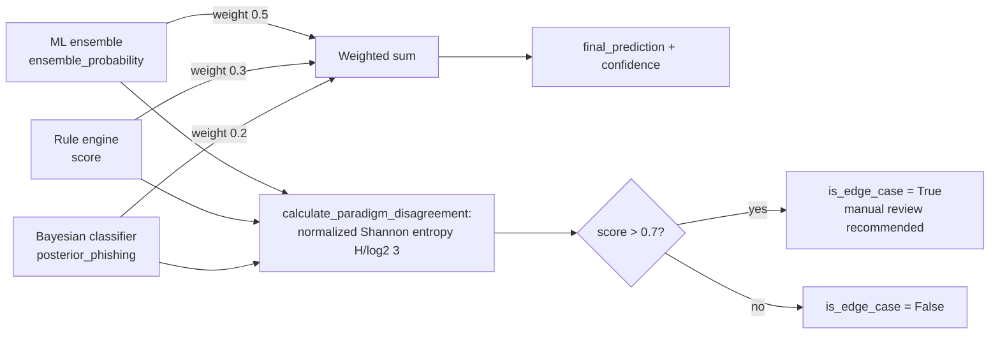

# Multi-Paradigm Aggregation and Disagreement-as-Signal (DOC-06 / DOC-07)

> Source: `src/paradigms/aggregation/` (`aggregator.py`, `weights.py`,
> `disagreement.py`); `.planning/STATE.md` "From 05-03"/"From 05-04";
> `.planning/PROJECT.md` Core Value statement. See
> [ensemble.md](./ensemble.md), [rule-based-system.md](./rule-based-system.md),
> and [bayesian.md](./bayesian.md) for the three paradigms combined here, and
> [../data-flow.md](../data-flow.md) for the request-time sequence through
> this layer. This page describes *cross-paradigm* disagreement (ML ensemble
> vs. rule engine vs. Bayesian classifier); see
> [ensemble.md](./ensemble.md) §"Classifier-level disagreement" for the
> separate, lower-level disagreement computed *within* the ML ensemble (among
> its 7 base classifiers).

`src/paradigms/aggregation/` is the integration layer that turns three
independently-reasoned verdicts — a 7-classifier ML ensemble
([ensemble.md](./ensemble.md)), a weighted expert-rule engine
([rule-based-system.md](./rule-based-system.md)), and a Bayes'-theorem
posterior probability ([bayesian.md](./bayesian.md)) — into a single final
verdict. It is also where PhishGuard's central thesis is operationalized:
`.planning/PROJECT.md`'s stated Core Value is "Integracja wielu paradygmatów
analizy w jeden spójny system, gdzie rozbieżności między metodami dostarczają
dodatkowego kontekstu i zwiększają wiarygodność decyzji klasyfikacyjnej"
("Integration of multiple analytical paradigms into one coherent system,
where disagreements between methods provide additional context and increase
the credibility of the classification decision"). `MultiParadigmAggregator`
is the concrete implementation of that sentence: it does not just average
three probabilities, it also *measures how much the three paradigms
disagree* and surfaces that measurement as a first-class output alongside
the verdict.

## Weighted combination

`MultiParadigmAggregator.aggregate(ml_result, rule_result, bayesian_result)`
extracts one probability from each paradigm — `ensemble_probability` from
the ML ensemble, `score` from the rule engine, `posterior_phishing` from the
Bayesian classifier — and combines them as a fixed linear weighted sum:

```python
# src/paradigms/aggregation/aggregator.py — aggregate()
final_probability = (
    self.weights.ml_ensemble * ml_prob +
    self.weights.rules * rule_prob +
    self.weights.bayesian * bayes_prob
)
final_prediction = 'phishing' if final_probability > 0.5 else 'legitimate'
confidence = 0.5 + abs(final_probability - 0.5)
```

The weights come from `ParadigmWeights`
(`src/paradigms/aggregation/weights.py`), a frozen-by-convention dataclass
with **defaults ML ensemble = 0.5, Rules = 0.3, Bayesian = 0.2** — chosen so
the statistically strongest paradigm (the 7-classifier ensemble, which
individually reaches up to 97.6-97.8% accuracy per
[ensemble.md](./ensemble.md)/[genetic-algorithm.md](./genetic-algorithm.md))
dominates the final score without being the *sole* determinant, while the
interpretable rule engine and the analytically-grounded Bayesian posterior
each retain enough weight to meaningfully shift the outcome. `__post_init__`
calls `_validate()`, which **raises `ValueError`** if the three weights do
not sum to `1.0` (within `1e-6` tolerance) — an invalid weight configuration
is a construction-time error, never silently renormalized — and additionally
emits soft `warnings.warn` (not an error) if any individual weight falls
outside its documented recommended band (ML `[0.4, 0.6]`, Rules `[0.2,
0.4]`, Bayesian `[0.1, 0.3]`), so a caller can intentionally experiment with
a different balance while still being told when a weight choice is unusual.
`confidence = 0.5 + |final_probability − 0.5|` is the distance of the final
probability from the 0.5 decision boundary, rescaled to `[0.5, 1.0]` — a
probability of exactly `0.5` (maximal uncertainty) yields confidence `0.5`,
while `0.0` or `1.0` (maximal certainty either way) yields confidence `1.0`.
This is the same confidence convention used by the Bayesian classifier
(`max(posterior)`, see [bayesian.md](./bayesian.md)) and conceptually
mirrors how certain each individual paradigm already reports its own
confidence.

`aggregate()` returns a structured dictionary that is the single source of
truth consumed by the `/predict/multi-paradigm` and `/predict/image` API
endpoints (see [../data-flow.md](../data-flow.md)):

```python
{
    'final_prediction': 'phishing',       # thresholded at 0.5
    'final_probability': 0.73,
    'confidence': 0.73,
    'paradigm_contributions': {
        'ml_ensemble': {'probability': ..., 'weight': 0.5,
                         'weighted_contribution': ..., 'prediction': ...},
        'rules':       {'probability': ..., 'weight': 0.3,
                         'weighted_contribution': ..., 'prediction': ...,
                         'rule_count': ...},
        'bayesian':    {'probability': ..., 'weight': 0.2,
                         'weighted_contribution': ..., 'prediction': ...},
    },
    'disagreement': {...},                 # see below
    'active_rules': [...],                 # fired_rules passed through from the rule engine
    'explanation': "Prediction: PHISHING (73.0% probability, moderate confidence) | ...",
}
```

`paradigm_contributions` reports each paradigm's raw probability, its
configured weight, and the *weighted* contribution (`probability × weight`)
separately — so a reader can see not just the final number but exactly how
much of it each paradigm is responsible for. `active_rules` passes the rule
engine's `fired_rules` list straight through (name/description/weight/
matched values per rule, see [rule-based-system.md](./rule-based-system.md)),
making this the structure the `/explain` endpoint's EXPL-01 ("which expert
rules fired, with weights") is built from (see
[explainability.md](./explainability.md)). `explanation` is generated by
`_generate_explanation()`: it reports the verdict and a bucketed confidence
label (`high` if the probability is beyond `0.8`/below `0.2`, `moderate`
beyond `0.65`/below `0.35`, `low` otherwise), a one-line summary of all
three paradigm scores, up to the top 3 fired rule names, and — only when
`disagreement_info['is_edge_case']` is true — an explicit `"WARNING: High
paradigm disagreement"` sentence recommending manual review. `update_weights()`
lets a caller swap in a different `ParadigmWeights` instance on an already-
constructed aggregator (e.g. for sensitivity experiments) without
re-instantiating the whole object.

## Cross-paradigm disagreement: normalized Shannon entropy

`calculate_paradigm_disagreement()` (`src/paradigms/aggregation/
disagreement.py`) is a direct structural extension of the classifier-level
disagreement metric from [ensemble.md](./ensemble.md), applied one layer
higher: instead of measuring how much 7 *classifiers* agree, it measures how
much the 3 *paradigms* agree. The mechanics are the same information-
theoretic construction — Shannon entropy of the binary vote distribution,
normalized by the maximum possible entropy for the number of voters — with
the only structural difference being `n = 3` paradigms instead of `n = 7`
classifiers, which changes the normalizing constant:

```python
# src/paradigms/aggregation/disagreement.py — calculate_paradigm_disagreement()
binary_preds = [1 if pred == 'phishing' else 0 for pred in predictions.values()]
unique, counts = np.unique(binary_preds, return_counts=True)
pk = counts / len(binary_preds)

H = entropy(pk, base=2)              # Shannon entropy, base-2 (bits)
max_H = np.log2(3)                   # max entropy for 3 binary voters ≈ 1.585
disagreement_score = H / max_H if max_H > 0 else 0.0
```

With 3 binary voters, the only possible vote splits are unanimous (`[3, 0]`,
entropy `H = 0`, `disagreement_score = 0.0` — all three paradigms agree) or
a 2-1 split (`[2, 1]`, entropy `H = -⅔·log2(⅔) - ⅓·log2(⅓) ≈ 0.918` bits,
`disagreement_score = 0.918 / 1.585 ≈ 0.579`) — a 3-voter system can never
reach an exact tie, so `disagreement_score = 1.0` (maximum possible entropy)
is mathematically unreachable here, just as an exact `0.5, 0.5` tie is
unreachable for the ensemble's odd `n = 7` classifiers. `PARADIGM_
DISAGREEMENT_THRESHOLD = 0.7` flags `is_edge_case = True` whenever the
normalized score exceeds `0.7` — deliberately the *same numeric threshold*
used for classifier-level disagreement in [ensemble.md](./ensemble.md), for
consistency across the two disagreement layers (`.planning/STATE.md` "From
05-03": "Disagreement threshold 0.7 consistent with Phase 3 classifier
disagreement detection"). Because the only non-zero disagreement value
achievable with 3 paradigms is `≈0.579` (below `0.7`), `is_edge_case`
in this layer in practice flags the vote-distribution-based score only in
combination with the function's additional diagnostics below — the vote
split alone is a necessary but not sufficient edge-case signal here, which
is why `calculate_paradigm_disagreement()` also returns `probability_
variance` and `probability_spread` (computed directly from the three raw
probabilities, not from the binarized votes) as complementary continuous
measures: two paradigms can cast the *same* binary vote (e.g. both
"phishing") while one is 51% confident and the other is 99% confident —
the vote-level entropy alone treats that as perfect agreement, while
`probability_variance`/`probability_spread` still expose the underlying
numeric disagreement.

The full disagreement payload also returns `vote_distribution` (`{'phishing':
N, 'legitimate': M}`), `disagreeing_paradigms` (the list of paradigm names
whose prediction differs from the majority vote), and `paradigm_probabilities`
(each paradigm's raw probability, keyed by name) — the same "who, not just
how much" transparency pattern used by the ensemble's `get_disagreement_
summary()` (see [ensemble.md](./ensemble.md)). `get_disagreement_explanation()`
converts this structured payload into prose with three tiers: below `0.3`,
"All paradigms agree on the prediction"; between `0.3` and `0.7`, a "Minor
disagreement" sentence naming the dissenting paradigm(s) and the majority
verdict; above `0.7`, a "High paradigm disagreement" sentence listing every
paradigm's exact probability and recommending manual review. This is the
text the `/explain` endpoint's EXPL-04 output is built from (see
[explainability.md](./explainability.md)).



## Disagreement-as-signal: the project's core thesis

The reason `disagreement` is a *returned, structured field* of `aggregate()`
— rather than an internal detail used only to adjust the final probability —
is the project's central methodological argument: **when independent
analytical paradigms, built on different assumptions and different evidence,
reach the same conclusion, that agreement is stronger evidence than any one
paradigm's confidence alone; and when they disagree, the disagreement itself
is diagnostic information, not noise to be smoothed away.** The three
paradigms combined here are deliberately *not* variations on the same
underlying model: the ML ensemble learns decision boundaries directly from
labeled training data across 7 structurally different algorithms (tree-
based, kernel-based, linear, see [ml-classifiers.md](./ml-classifiers.md));
the rule engine encodes **explicit, human-authored domain knowledge** as
weighted conditions with no learning step at all (see
[rule-based-system.md](./rule-based-system.md)); and the Bayesian classifier
reasons from an analytically-grounded probabilistic model under an explicit
conditional-independence assumption (see [bayesian.md](./bayesian.md)). A
URL that fools a pattern-learned ensemble (e.g. by resembling the training
distribution's legitimate examples closely enough) has no particular reason
to also fool a hand-authored rule checking for a specific known phishing
technique, or a Bayesian posterior built from a different feature-weighting
logic — which is precisely what makes cross-paradigm agreement a stronger
signal than any single paradigm's own self-reported confidence, and
cross-paradigm *disagreement* a flag that at least one paradigm's
assumptions have broken down for this particular input, worth surfacing to
a human reviewer rather than silently resolved by the weighted average.

This mirrors, one layer up, the same argument already made for
classifier-level disagreement in [ensemble.md](./ensemble.md) ("the
project's stated core value is that disagreement between methods is itself
useful information, not noise to be averaged away") — but at the paradigm
level the argument is stronger, because the three paradigms differ in *kind*
(learned vs. rule-authored vs. probabilistic-analytic), not merely in *which
learning algorithm* was used. Two disagreeing classifiers inside the same
ensemble share the same training data, the same feature set, and the same
optimization objective; two disagreeing *paradigms* may be responding to
genuinely different evidence (a rule can fire on a textual pattern the ML
model's feature set does not encode at all, or the ML model can learn a
subtle statistical regularity no rule author anticipated), which is exactly
why this top-level disagreement is treated by the project as its distinctive
contribution: every multi-paradigm response (`/predict/multi-paradigm` and
`/predict/image`, see [../data-flow.md](../data-flow.md)) carries
`disagreement.score`, `disagreement.is_edge_case`, and `disagreement.
disagreeing_paradigms` as first-class fields, and the `/explain` endpoint
dedicates EXPL-04 specifically to explaining *why* the paradigms disagree
when they do (see [explainability.md](./explainability.md)) — the
disagreement is reported with the same prominence as the verdict itself,
not relegated to a debug log.

## Measured behavior

`.planning/STATE.md` "From 05-05" records human-verified end-to-end
behavior consistent with this design: a known-suspicious URL produced a
98.9% phishing verdict with 5 rules fired (all three paradigms in strong
agreement — low disagreement, high confidence), while a legitimate URL
produced a 0.7% phishing verdict with no rules fired (again strong
agreement, this time toward "legitimate"). The 20-test aggregation suite
(`.planning/STATE.md` "From 05-03") validates weight validation,
disagreement detection, and the full aggregation path, running in 0.38s as
part of the project's broader test suite.
