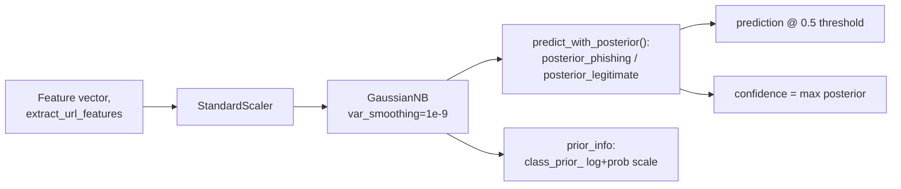

# Bayesian Probabilistic Classifier (DOC-06 / DOC-07)

> Source: `src/paradigms/bayesian/classifier.py`; `.planning/STATE.md`
> "From 05-02"; `praca-inzynierska.pdf` §4.6 (Bayes' theorem notation and
> measured figures, cited for consistency — not reproduced verbatim). See
> [ml-classifiers.md](./ml-classifiers.md) §6 for the *ensemble's* Naive
> Bayes member (a different, GA-tuned model — see "Two Naive Bayes
> models" below), and [rule-based-system.md](./rule-based-system.md) for
> the other non-ML paradigm this classifier sits alongside.

## Bayes' theorem and classification

Bayes' theorem, formulated by Thomas Bayes in the mid-18th century and
published posthumously in 1763, lets probabilistic reasoning be inverted:
if the quantity of direct interest is the probability of class `C` *given*
an observed feature vector `X = (x₁, x₂, ..., xₙ)` — which is usually not
directly measurable — Bayes' theorem expresses it in terms of quantities
that *can* be estimated from training data:

```
P(C | X) = P(X | C) · P(C) / P(X)
```

Four terms make up this formula. `P(C | X)` is the **posterior** — the
probability of the class after observing the features, the output of
interest. `P(X | C)` is the **likelihood** — the probability of observing
this particular feature vector if the class really were `C`. `P(C)` is
the **prior** — the class probability with no feature information at
all, estimated directly from class frequencies in the training set.
`P(X)` is the **evidence**, a normalizing denominator that does not
depend on the choice of class and can be dropped entirely for binary
classification, since it is identical for both the phishing and
legitimate hypotheses and therefore cancels out of any `P(C=phishing|X)`
vs. `P(C=legitimate|X)` comparison.

Computing `P(X | C)` directly for a high-dimensional `X` requires
estimating a full joint distribution over all features, which is
intractable in practice (the curse of dimensionality). **Naive Bayes**
resolves this by assuming **conditional independence** between features
given the class:

```
P(X | C) = ∏ᵢ P(xᵢ | C)
```

This collapses the number of distribution parameters to estimate from
exponential to linear in the number of features — each `P(xᵢ | C)` can be
estimated independently. The conditional-independence assumption is
routinely violated by real feature sets (in this project's URL features,
`url_length` correlates with `special_char_count`, `dot_count` correlates
with `subdomain_count`, and so on), but classical results show that
*classification accuracy* remains high even when the assumption is
violated, because errors in the individual conditional-probability
estimates tend to cancel out *symmetrically* across the two classes when
the correlation structure is roughly similar for both — the absolute
probability estimates can be wrong while the relative ranking between
classes (which is all a threshold-based classifier needs) stays
approximately correct.

### Gaussian variant

The **Gaussian** Naive Bayes variant assumes each continuous feature is
normally distributed within each class, with class-conditional mean `μ`
and variance `σ²` estimated from the training data:

```
P(xᵢ | C) = 1/√(2π·σᵢ,C²) · exp(−(xᵢ − μᵢ,C)² / (2·σᵢ,C²))
```

`sklearn.naive_bayes.GaussianNB`'s `var_smoothing` parameter adds a small
constant to every feature's estimated variance, preventing division by a
near-zero variance (numerically unstable, and pathological for any
feature that happens to be near-constant within a class in the training
sample). This is GaussianNB's only tunable hyperparameter. Notably, the
**GA-optimized Naive Bayes ensemble member** (see
[ml-classifiers.md](./ml-classifiers.md), part of the 7-classifier
ensemble, tuned via the genetic-algorithm layer documented in
[genetic-algorithm.md](./genetic-algorithm.md)) was found by the GA to
perform best with `var_smoothing ≈ 4.4 × 10⁻¹¹` — several orders of
magnitude below scikit-learn's `1e-9` default — a value whose
log-scale sensitivity makes it an awkward target for manual tuning or
grid search but a natural fit for `cxBlend`'s log-space-agnostic
continuous search (see [genetic-algorithm.md](./genetic-algorithm.md)).

## Two Naive Bayes models — do not conflate

PhishGuard contains **two distinct GaussianNB-based components**, and this
page documents only the second:

1. **The ensemble's Naive Bayes classifier** (`CLASSIFIER_CONFIGS['nb']`
   in `src/models/classifiers.py`, documented in
   [ml-classifiers.md](./ml-classifiers.md) §6) — one of the 7 base
   classifiers combined by soft voting / hard voting / stacking in
   [ensemble.md](./ensemble.md). It participates in the ML-ensemble
   paradigm and is GA-tuned alongside the other 6 classifiers.
2. **`BayesianClassifier`** (`src/paradigms/bayesian/classifier.py`,
   documented below) — a **standalone probabilistic paradigm**, trained
   and evaluated independently of the ensemble, whose role in the
   multi-paradigm aggregation layer (a later `docs/algorithms/
   aggregation.md` plan, 10-06) is to provide an explicit, Bayes-theorem-
   grounded posterior probability alongside (not as part of) the ML
   ensemble's verdict and the rule engine's score.

Both wrap `sklearn.naive_bayes.GaussianNB` with a `StandardScaler`
preprocessing step and share the same underlying statistical model —
the distinction is architectural (ensemble member vs. independent
paradigm), not algorithmic.

## The project's `BayesianClassifier`

`src/paradigms/bayesian/classifier.py::BayesianClassifier` wraps
`GaussianNB` in an `sklearn.pipeline.Pipeline`:

```python
self.pipeline = Pipeline([
    ('scaler', StandardScaler()),
    ('classifier', GaussianNB(var_smoothing=var_smoothing))  # default 1e-9
])
```

As with every other classifier Pipeline in this project (see
[ml-classifiers.md](./ml-classifiers.md)), `StandardScaler` is fit only
on whatever data the Pipeline itself is trained on, which both improves
GaussianNB's numerical stability when estimating per-feature variance
(features on wildly different native scales — raw counts vs. entropy
vs. binary flags — would otherwise distort the Gaussian variance
estimates) and preserves the leakage-prevention discipline used
throughout the pipeline. The `var_smoothing` parameter defaults to
`1e-9` (scikit-learn's own default) and is *not* GA-tuned for this
standalone classifier — unlike the ensemble's Naive Bayes member (see
above), `BayesianClassifier` is trained with a fixed, conservative
smoothing value, since its purpose here is to serve as an independent,
analytically-grounded probabilistic reference point, not to be squeezed
for maximum F1 the way an ensemble member would be.

### `predict_with_posterior()`

The classifier's primary interface is not the standard `predict`/
`predict_proba` pair (though both are provided for compatibility) but
`predict_with_posterior(X)`, which returns a structured dictionary
designed for the aggregation layer and for direct human inspection:

```python
{
    'posterior_phishing': 0.87,      # P(phishing | features)
    'posterior_legitimate': 0.13,    # P(legitimate | features)
    'prediction': 'phishing',        # thresholded at 0.5
    'confidence': 0.87,              # max(posterior_phishing, posterior_legitimate)
    'prior_info': {
        'log_prior_legitimate': -0.6931,
        'log_prior_phishing': -0.6931,
        'prior_legitimate': 0.5,
        'prior_phishing': 0.5,
    },
}
```

`posterior_phishing`/`posterior_legitimate` come directly from
`pipeline.predict_proba(X)[0]` — GaussianNB's computed `P(C | X)` for
each class, following the Bayes'-theorem formula above with the evidence
term `P(X)` implicitly normalized away by scikit-learn's own
implementation. `prediction` applies the same `0.5` decision threshold
used consistently across every paradigm in this project (the ML
ensemble, the rule engine — see [rule-based-system.md](
./rule-based-system.md) — and cross-paradigm aggregation). `confidence`
is the maximum of the two posteriors (equivalently, the distance of the
winning class's posterior from the midpoint, rescaled to `[0.5, 1.0]`),
distinct from but philosophically aligned with the rule engine's
`|score - 0.5|` confidence convention.

**`prior_info`** is extracted directly from the fitted `GaussianNB`'s
`class_prior_` attribute (not `class_log_prior_`, which some other
scikit-learn Naive Bayes variants, e.g. `MultinomialNB`, expose instead —
`GaussianNB` stores priors on the probability scale and the log-scale
value is computed explicitly via `np.log(priors)` for this output). Both
scales are reported for interpretability: the probability-scale priors
(`prior_legitimate`, `prior_phishing`) answer "what would this classifier
predict with zero feature information, based purely on the training
set's class balance?", while the log-scale priors (`log_prior_legitimate`,
`log_prior_phishing`) are the form actually used internally by
Gaussian Naive Bayes' log-likelihood computation, and are reported for
readers who want to trace the model's internal arithmetic rather than
only its final output.

```python
# src/paradigms/bayesian/classifier.py — predict_with_posterior()
posterior = self.pipeline.predict_proba(X)[0]
classifier = self.pipeline.named_steps['classifier']
priors = classifier.class_prior_

return {
    'posterior_phishing': float(posterior[1]),
    'posterior_legitimate': float(posterior[0]),
    'prediction': 'phishing' if posterior[1] > 0.5 else 'legitimate',
    'confidence': float(max(posterior)),
    'prior_info': {
        'log_prior_legitimate': float(np.log(priors[0])),
        'log_prior_phishing': float(np.log(priors[1])),
        'prior_legitimate': float(priors[0]),
        'prior_phishing': float(priors[1])
    }
}
```

## Posterior calibration caveat

The classifier's own docstrings carry an explicit warning, repeated here
because it materially affects how downstream consumers should treat the
output: **Naive Bayes posteriors are frequently poorly calibrated**. The
model's prediction arises from multiplying together many per-feature
conditional-probability estimates; the product of ten probabilities each
below 0.5 is already around 0.001, and after renormalizing across the two
classes this tends to push the final posterior toward the extremes (near
`0.0` or `1.0`) even in cases where the *actual* classification
uncertainty is considerably higher. For binary classification against a
fixed `0.5` threshold this miscalibration has limited practical impact —
the decision itself is usually still correct — but it does mean the
*numeric value* of `posterior_phishing` should be read as a **ranking
signal** (which samples does this model consider more vs. less
phishing-like) rather than a well-calibrated absolute probability
estimate (e.g. "this specific sample has exactly an 87% chance of being
phishing" is not a claim the model actually supports without additional
calibration). Isotonic or Platt calibration are standard remedies for
this miscalibration but are **not applied in the current implementation**
— calibration is noted as a future-work direction rather than solved
here.

## Role in the multi-paradigm architecture

Despite the calibration caveat, `BayesianClassifier` contributes two
things the ML ensemble and rule engine do not provide on their own.
First, it assumes conditional feature independence, which is a
fundamentally different modeling assumption from the tree-based,
kernel-based, and rule-based reasoning used everywhere else in the
project — when its verdict and the ensemble's agree, that agreement
carries more combined evidentiary weight than two methods built on
similar assumptions agreeing would; when they disagree, that disagreement
is itself informative (the project's core multi-paradigm thesis,
elaborated fully in a later `docs/algorithms/aggregation.md` plan, 10-06).
Second, it produces an explicit, analytically-grounded probability
estimate in the literal language of Bayesian inference (`prior_info`,
posteriors), rather than an opaque ensemble-averaged score — useful for
any downstream consumer that wants a probabilistic credibility context
for the ML ensemble's verdict, stated in terms a statistics-literate
reader can directly interpret via Bayes' theorem, rather than reverse-
engineering what a 7-classifier soft-voting average actually represents
probabilistically.

## Measured performance

The trained `BayesianClassifier` achieves **F1 = 0.9390** (5-fold cross-
validation) on the 200-sample URL training set
(`.planning/STATE.md` "From 05-02") — comparable to, though below, the
GA-optimized individual ML classifiers reported in
[ml-classifiers.md](./ml-classifiers.md) (which range from 0.9438 for the
ensemble's own Naive Bayes member up to 0.9749 for Logistic Regression).
This is consistent with the general Naive Bayes trade-off described
above: the conditional-independence assumption costs some accuracy
relative to classifiers that can model feature interactions directly
(Random Forest, XGBoost), but the resulting model is extremely
lightweight — the trained pipeline serializes to roughly **2.0 KB**
compressed via `joblib` — and integrates directly with the same
`extract_url_features()` pipeline used throughout the rest of the
project, requiring no separate feature-engineering path.


