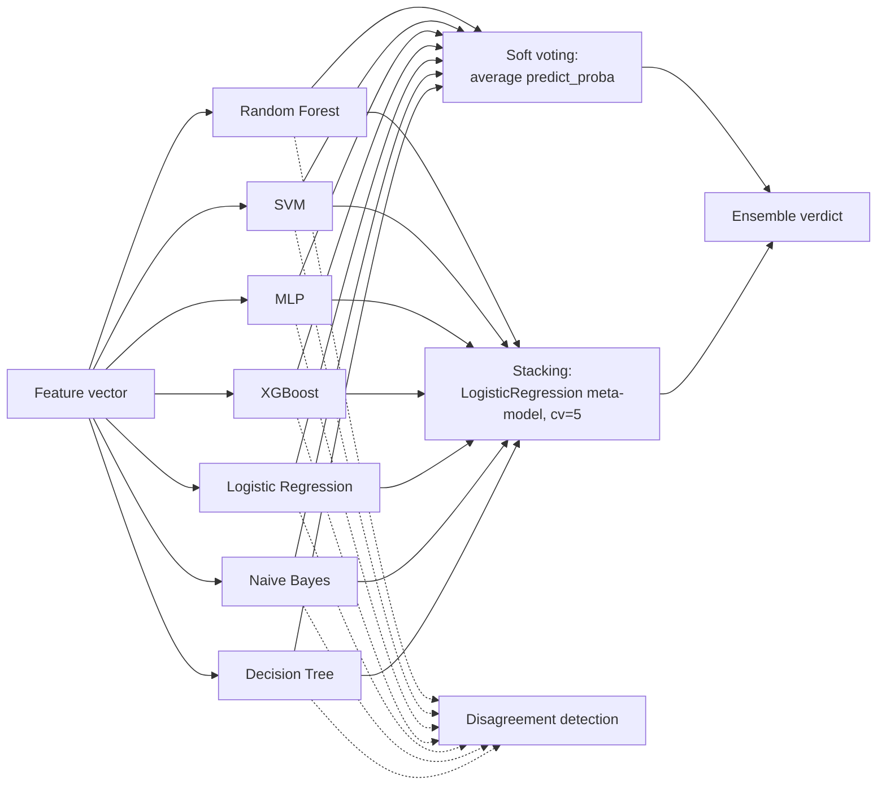

# Ensemble Aggregation and Classifier Disagreement (DOC-06 / DOC-07)

> Source: `src/models/ensemble.py`, `src/models/disagreement.py`;
> `praca-inzynierska.pdf` §4.3.8-4.3.9 and Table 6 (measured figures, cited
> for consistency — not reproduced verbatim). See
> [ml-classifiers.md](./ml-classifiers.md) for the 7 base classifiers
> combined here. This page describes *classifier-level* disagreement
> (within the ML ensemble); a later `docs/algorithms/aggregation.md` plan
> describes the separate, higher-level *cross-paradigm* disagreement
> computed by `MultiParadigmAggregator` (ML ensemble vs. rule engine vs.
> Bayesian classifier).

`src/models/ensemble.py` implements three ways of combining the seven
classifiers from [ml-classifiers.md](./ml-classifiers.md) into a single
verdict: soft voting, hard voting, and stacking. All three outperform any
individual classifier (see the comparison table at the end of
[ml-classifiers.md](./ml-classifiers.md)), because averaging predictions
from models with different error profiles cancels out some of each
individual model's mistakes — provided the models are not all wrong on the
same inputs, which is exactly the diversity argument used throughout
[ml-classifiers.md](./ml-classifiers.md) (e.g. for keeping Naive Bayes in
the ensemble despite its low standalone accuracy).

## Soft voting

`create_voting_ensemble(estimators, voting='soft')` wraps the seven
classifier pipelines in an `sklearn.ensemble.VotingClassifier` configured
with `voting='soft'`. Soft voting averages the `predict_proba()` output
(the per-class probability vector) across all seven classifiers and takes
the arg-max of the average. This is why `SVC(probability=True)` is
non-negotiable for SVM (see [ml-classifiers.md](./ml-classifiers.md)) — every
estimator in a soft-voting ensemble must expose calibrated class
probabilities. Soft voting is the default ML-ensemble aggregation mode in
this project; the ensemble reaches **97.47% accuracy** on the temporal URL
test set (consistent with the figure reported in the root `README.md`),
ahead of every individual classifier.

## Hard voting

`create_voting_ensemble(estimators, voting='hard')` uses the same
`VotingClassifier` machinery but with `voting='hard'`: each classifier
casts one binary vote (its predicted class label, not its probability),
and the ensemble prediction is the majority label. Hard voting does not
require `predict_proba()` support at all. Its measured accuracy
(**97.01%**, per `praca-inzynierska.pdf` Table 6) is lower than soft
voting's, because it discards the *degree* of confidence behind each
classifier's vote — a classifier that is 51% confident in "phishing" counts
exactly as much as one that is 99% confident, whereas soft voting lets the
more-confident classifier's probability pull the averaged decision further
toward its verdict.

## Stacking

`create_stacking_ensemble(estimators)` builds an
`sklearn.ensemble.StackingClassifier` with a separate **meta-model** —
`LogisticRegression(class_weight='balanced', max_iter=1000,
random_state=42)` — trained on the seven base classifiers' predictions
rather than on the raw features directly (`passthrough=False`). Instead of
a fixed combination rule (averaging, majority vote), stacking *learns*
how much to trust each base classifier.

The critical leakage-prevention detail is **`cv=5`**: the meta-model is not
trained on the base classifiers' predictions for the rows they were
themselves trained on (which would be an overly optimistic, near-perfect
signal for a well-fit base classifier); instead, scikit-learn internally
performs 5-fold cross-validation over the training set, and each row's
meta-features come from a fold-held-out base-classifier prediction — a base
classifier never contributes a prediction, to the meta-model's training
data, for a row it personally saw during its own fit. This mirrors the
same leakage-avoidance principle enforced earlier by the temporal
train/val/test split and by scaling only on training data (see
[data-pipeline.md](./data-pipeline.md) and
[ml-classifiers.md](./ml-classifiers.md)) — consistent leakage discipline
at every layer of the pipeline, not just the top-level data split.

```python
# src/models/ensemble.py — create_stacking_ensemble()
ensemble = StackingClassifier(
    estimators=estimators,
    final_estimator=LogisticRegression(
        class_weight='balanced', max_iter=1000, random_state=42
    ),
    cv=5,               # 5-fold CV prevents data leakage into the meta-model
    stack_method='auto',  # uses predict_proba when available
    passthrough=False,    # meta-model sees only base predictions, not raw features
    n_jobs=-1,
)
```

Stacking achieves the highest accuracy of the three fixed-combination-rule
variants measured in this project — **97.64%** (`praca-inzynierska.pdf`
Table 6) — because the learned meta-model can, in principle, assign higher
weight to classifiers that tend to be right when others are wrong, rather
than treating all seven classifiers as equally trustworthy the way voting
does. (A fourth variant, GA-optimized weighted voting, reaches 97.78% but
belongs to the genetic-algorithm optimization layer documented in a later
`docs/algorithms/genetic-algorithm.md` plan, not to this file.)



## Extracting individual predictions

`get_individual_predictions(voting_model, X)` reaches into a fitted
`VotingClassifier`'s `named_estimators_` and calls `predict_proba()` on
each base estimator independently, returning a per-classifier dict of
`phishing_probability`, `prediction`, and `confidence`. This function is
the bridge between "one ensemble verdict" and "what did each of the seven
classifiers individually think" — its output is what feeds both the
disagreement calculation below and the API's `/predict/ensemble` response,
which surfaces all seven individual verdicts alongside the ensemble's.

## Classifier-level disagreement (normalized Shannon entropy)

`src/models/disagreement.py` answers a question the ensemble verdict alone
cannot: *how much did the seven classifiers actually agree?* A soft-voting
ensemble can output "60% phishing" either because all seven classifiers
weakly lean phishing, or because several are strongly certain it is
phishing while others are strongly certain it is legitimate — these are
very different situations from a trust standpoint, and the ensemble
probability alone conflates them.

`calculate_disagreement(individual_predictions)`:

1. Converts each classifier's probability into a binary vote
   (`phishing` if `phishing_probability >= 0.5`, else `legitimate`).
2. Builds the empirical vote distribution `pk` (fraction of classifiers
   voting each way).
3. Computes the **Shannon entropy** `H = -Σ pk·log2(pk)` of that
   distribution.
4. **Normalizes** by the maximum possible entropy for `n` classifiers,
   `log2(n)`: `disagreement = H / log2(n)`.

For the project's 7 classifiers, a unanimous `[7, 0]` vote split yields
entropy `0` (perfect agreement), while the most-split realistic
distribution `[4, 3]` yields a normalized entropy that approaches — but,
for an odd number of classifiers, never reaches — `1.0` (near-maximum
disagreement; an exact `[n/2, n/2]` tie, entropy `1.0`, is impossible with
an odd `n=7`). The function returns a float in `[0, 1]`: `0` means every
classifier agrees, values near `1` mean the vote is close to an even
split.

**Why entropy rather than a simpler measure** (e.g. the raw minority-vote
proportion): entropy treats a `[6, 1]` split and a `[5, 2]` split
differently, which matches the intuition that one dissenting classifier out
of seven is a weaker disagreement signal than two dissenting classifiers —
a proportion-of-minority-votes measure would also distinguish these cases,
but entropy is the information-theoretic quantity that formalizes "how
unpredictable is the outcome of picking a random classifier's vote",
which is precisely what we want "disagreement" to mean, and it naturally
degenerates to exactly zero for a unanimous vote, which fits cleanly with
how the cross-paradigm aggregator (`docs/algorithms/aggregation.md`, later
plan) treats zero-disagreement cases as the simplest, most-trustworthy
inputs.

`is_edge_case(disagreement_score, threshold=DISAGREEMENT_THRESHOLD)`
flags a prediction as an **edge case** when the normalized entropy exceeds
`DISAGREEMENT_THRESHOLD = 0.7` — a high bar, deliberately, for a binary
classification scenario: with 7 classifiers, reaching above 0.7 requires a
vote split at or beyond roughly 4-3, i.e. close to the practical maximum of
disagreement achievable with an odd number of binary voters. This
threshold is empirically chosen (not derived analytically) and is shared
with the cross-paradigm disagreement threshold used in
`docs/algorithms/aggregation.md` (later plan), for consistency across the
two disagreement layers.

`get_disagreement_summary(individual_predictions)` wraps the score into a
structured diagnostic object: the raw `score`, the boolean `is_edge_case`
flag, the `vote_distribution` (`{'phishing': N, 'legitimate': M}`), and two
explicit lists — `agreeing_classifiers` and `dissenting_classifiers` —
derived by comparing every classifier's individual vote against the
majority vote. This is what the `/predict/ensemble` endpoint returns
alongside the ensemble verdict, and it is what makes classifier-level
disagreement a **first-class diagnostic signal** rather than an internal
implementation detail: an analyst (or, in the multi-paradigm case, the
aggregation layer) can see not just "the classifiers disagreed" but
*which* classifiers dissented and by how much, which foreshadows the same
design pattern reused one layer up in cross-paradigm aggregation
(`docs/algorithms/aggregation.md`, later plan) — the project's stated core
value is that disagreement between methods is itself useful information,
not noise to be averaged away.

## Model persistence

`save_ensemble(model, path, model_type, metadata)` / `load_ensemble(path)`
persist fitted ensembles with `joblib.dump(..., compress=3, protocol=5)`,
alongside metadata (model type, creation timestamp, scikit-learn version,
estimator names) for provenance tracking — mirroring the same
metadata-alongside-data discipline used for cached datasets in
[data-pipeline.md](./data-pipeline.md). `load_ensemble()` also transparently
supports a legacy format (a bare model with no metadata wrapper), so older
saved artifacts remain loadable without a migration step.
