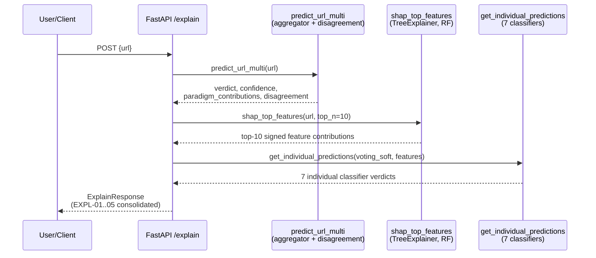

# SHAP Explainability (DOC-06 / DOC-07)

> Source: `src/explainability/shap_explain.py`, `src/api/endpoints.py`
> (`/explain`), `src/api/main.py` (lifespan warm-up). See
> [aggregation.md](./aggregation.md) for the paradigm-contribution and
> disagreement data this endpoint consolidates, and
> [../data-flow.md](../data-flow.md) for where `/explain` sits relative to
> the fast prediction paths.

Every prediction endpoint documented so far (`/predict`, `/predict/
multi-paradigm`, `/predict/image`) answers "what is the verdict?". `/explain`
answers a different question — "why?" — by combining feature-level SHAP
attribution with the already-computed cross-paradigm reasoning from
[aggregation.md](./aggregation.md) into a single consolidated report. It
exists as a **separate, slower endpoint** by deliberate design: SHAP
computation is never run on the fast `/predict*` paths (the endpoint
docstring: "Slower than /predict/multi-paradigm (SHAP is never run on the
fast prediction path by design)"), keeping the synchronous prediction
latency low while still making a full explanation available on demand.

## SHAP theory

SHAP (**SH**apley **A**dditive exPlanations) attributes a model's prediction
for a single input to its individual input features by computing each
feature's **Shapley value** — a concept from cooperative game theory that
answers "how much does including this feature, averaged over every possible
order in which features could be revealed, change the model's output?".
Formally, for a prediction `f(x)` and a baseline (expected) prediction
`E[f(X)]` over a background dataset, SHAP guarantees the **additivity**
property:

```
f(x) = E[f(X)] + Σᵢ φᵢ
```

where `φᵢ` is feature `i`'s Shapley value (its signed contribution) — the
sum of every feature's contribution, plus the baseline, exactly reconstructs
the model's actual output for that input. This additivity is what makes SHAP
values directly comparable and summable across features in a way an
unprincipled heuristic (e.g. raw feature magnitude) is not, and is the
property that justifies ranking and reading off a "top-N contributing
features" list the way `shap_top_features()` does below.

Computing exact Shapley values naively requires evaluating the model on
every possible subset of features — exponential in the number of features
and intractable for anything beyond a handful. `shap.TreeExplainer` avoids
this by exploiting the internal structure of tree-based models (decision
paths, split conditions) to compute **exact** Shapley values in polynomial
time rather than approximating them — which is also why this project's SHAP
explainer targets a tree-based model specifically (Random Forest) rather
than an arbitrary model type.

## Why Random Forest, URL-only, v1

`warm_shap_explainer()` builds its explainer for the GA-optimized Random
Forest `Pipeline` (`ml_models["phishing_detector"]`, retrieved via
`get_active_model("rf")` — see
[genetic-algorithm.md](./genetic-algorithm.md) for how this GA-optimized
model is selected), explicitly **not** for `voting_soft`, the heterogeneous
7-classifier `VotingClassifier` used elsewhere (see
[ensemble.md](./ensemble.md)). `shap.TreeExplainer` requires a tree-based
estimator; a `VotingClassifier` mixing Random Forest, SVM, MLP, XGBoost,
Logistic Regression, Naive Bayes, and Decision Tree has no single fast,
exact SHAP explainer that covers all seven member algorithms at once
(`src/explainability/shap_explain.py` docstring cites this as a deliberate
v1 scope decision). Random Forest is chosen as a single **representative**
model — tree-based (so `TreeExplainer` applies exactly, not approximately),
and one of the project's measured-strong individual classifiers (see
[ml-classifiers.md](./ml-classifiers.md)) — rather than attempting to
explain every ensemble member simultaneously. This is also why SHAP in this
project is **URL-only**: `extract_url_features()` is the schema the RF
pipeline and its background dataset were both built against; email/SMS/image
explanation via SHAP is out of v1 scope.

## `warm_shap_explainer()` and the background dataset

```python
# src/explainability/shap_explain.py — warm_shap_explainer()
background_data = joblib.load(BACKGROUND_PATH)   # cache/url_training_data.joblib
X_background = background_data["X_train"]

if X_background.shape[1] != clf.n_features_in_:
    raise ValueError(...)   # stale-cache guard

X_background_scaled = scaler.transform(X_background)
explainer = shap.TreeExplainer(clf, X_background_scaled)
```

`TreeExplainer` needs a **background dataset** — a reference sample of
"typical" inputs — against which each new prediction's Shapley values are
computed relative to (this is what grounds `E[f(X)]` above in an actual
empirical distribution rather than an arbitrary zero point).
`BACKGROUND_PATH = cache/url_training_data.joblib` is used specifically
because its `X_train` is schema-correct: a 200×30 array whose 30 columns
match `extract_url_features()` exactly. The module's own source comments are
explicit that three sibling cache files in the same directory
(`train_balanced.joblib`, `test.joblib`, `validation.joblib`) use a stale,
incompatible 35-column UCI-encoded schema and **must never** be substituted
here — `warm_shap_explainer()` defends against that mistake at
construction time by comparing `X_background.shape[1]` against the live
classifier's `n_features_in_` and raising `ValueError` loudly on any
mismatch, rather than silently computing SHAP values against misaligned
columns. The background sample is scaled through the pipeline's own fitted
`StandardScaler` before being handed to `TreeExplainer`, so Shapley values
are computed in the same standardized-feature space the Random Forest
itself was trained on.

`warm_shap_explainer()` is **idempotent** — a second call returns the
already-cached explainer immediately without re-importing `shap` or
rebuilding anything, which matters because `shap` (plus its transitive
`numba`/`llvmlite` JIT-compilation dependencies) costs roughly 1.9 seconds
to cold-import. Like the EasyOCR reader (see
[ocr-visual.md](./ocr-visual.md)), it is called once from the FastAPI
`lifespan` startup hook (`src/api/main.py`) rather than on the first
`/explain` request, so that cost is paid once at process startup. If `shap`
is not installed, the `ImportError` propagates out of `warm_shap_explainer()`
to the lifespan hook, which catches it and simply leaves
`ml_models["shap_explainer"]` unset — `/explain` then responds with a clean
`503 Service Unavailable` ("SHAP explainer not available. Install shap and
restart.") instead of the application failing to start. This graceful-
degradation pattern mirrors the OCR backend's `NullOCRBackend` fallback (see
[ocr-visual.md](./ocr-visual.md)): a missing optional dependency degrades a
specific feature, not the whole service.

## `shap_top_features()`: top-10 feature contributions

```python
# src/explainability/shap_explain.py — shap_top_features()
features = extract_url_features(url)
X_scaled = pipeline.named_steps["scaler"].transform(X)
shap_values = explainer.shap_values(X_scaled)
# sklearn-native RF: shape (1, n_features, n_classes) -> take class 1 (phishing)
contrib = sv_arr[0, :, 1] if sv_arr.ndim == 3 else sv_arr[0]
top_idx = np.argsort(np.abs(contrib))[::-1][:top_n]
```

For a given URL, `shap_top_features()` extracts the standard 30-feature
vector, scales it through the same fitted `StandardScaler`, and computes
SHAP values via the warm explainer. It branches on the returned array's
`ndim` because different `shap`/scikit-learn version combinations represent
a binary Random Forest's output differently — either `(1, n_features,
n_classes)` (requiring indexing into class 1, "phishing") or `(1,
n_features)` directly — rather than assuming one fixed shape. The top-`N`
(default **10**) features are selected by **descending absolute SHAP
value** (`np.argsort(np.abs(contrib))[::-1]`) — ranking by magnitude of
influence regardless of direction, so a feature that strongly pushes the
prediction *toward* "legitimate" ranks just as highly as one that strongly
pushes it toward "phishing". Each returned entry is
`{"feature": name, "shap_value": signed contribution, "raw_value":
unscaled feature value}` — `raw_value` is reported in the feature's natural,
human-readable scale (e.g. an actual URL length, not a standardized z-score)
even though the SHAP value itself was computed in standardized-feature
space, so a reader sees both "how much did this feature push the decision"
and "what was its actual value" without needing to un-scale anything
mentally.

## The consolidated `/explain` endpoint

`POST /explain` (`src/api/endpoints.py::explain`) does not introduce new
reasoning — it **consolidates** outputs already computed elsewhere in the
project into one response, directly fulfilling five requirements (EXPL-01
through EXPL-05):

| Requirement | What it means | Where the data comes from |
|---|---|---|
| EXPL-01 | Which expert rules fired, with weights | `aggregated['active_rules']` — passed straight through from the rule engine via `MultiParadigmAggregator.aggregate()` (see [aggregation.md](./aggregation.md) and [rule-based-system.md](./rule-based-system.md)) |
| EXPL-02 | SHAP feature importance for the ML decision | `shap_top_features(request.url, top_n=10)` — this page |
| EXPL-03 | Comparison of all classifiers' individual predictions | `get_individual_predictions(ml_models["voting_soft"], feature_array)` — the same function documented in [ensemble.md](./ensemble.md), returning all 7 classifiers' individual verdicts |
| EXPL-04 | A fuller explanation of cross-paradigm disagreement | `get_disagreement_explanation(aggregated["disagreement"])` — the prose-generating function documented in [aggregation.md](./aggregation.md) |
| EXPL-05 | A natural-language report of the decision | `aggregated["explanation"]`, enriched with the single top SHAP feature |

The request flow: `explain()` first calls `predict_url_multi(request.url)`
to get the full multi-paradigm `aggregated` result (identical to what
`/predict/multi-paradigm` would return — see [aggregation.md](./aggregation.md)),
then layers SHAP and the all-classifier comparison on top. SHAP computation
is wrapped in its own `try/except`: an unexpected failure *during* SHAP
computation (as opposed to the explainer being entirely absent, already
503'd earlier) degrades to `ShapExplanation(available=False, ..., note=
f"SHAP computation failed: {e}")` rather than a 500 — a transient SHAP
failure should not take down the rest of the (already successfully computed)
explanation.

EXPL-05's natural-language enrichment is a small, deliberate text
concatenation rather than a separate generation step:

```python
# src/api/endpoints.py — explain()
explanation = aggregated["explanation"]
if top_features:
    top_feature = top_features[0]
    explanation += (
        f" Top contributing feature: {top_feature['feature']} "
        f"(contribution {top_feature['shap_value']:+.4f})."
    )
```

This takes the aggregator's own verdict/confidence/paradigm-summary sentence
(see [aggregation.md](./aggregation.md) §"Weighted combination") and appends
exactly one sentence naming the single highest-|SHAP-value| feature and its
signed contribution — connecting the paradigm-level explanation ("why did
each paradigm vote this way, and how much did they agree") with a concrete,
feature-level reason from the ML side ("and specifically, this one feature
mattered most"), without duplicating or restating the full top-10 SHAP list
inline.



## Response shape

`ExplainResponse` nests `individual_predictions` (EXPL-03, 7
`ClassifierResult` entries), `paradigm_contributions` (the same structure
documented in [aggregation.md](./aggregation.md)), `shap` (a
`ShapExplanation` with `available`, `content_type="url"`, `model="rf"`,
`top_features`, and an explanatory `note` — including the caveat that SHAP
values are "relative contributions in standardized-feature space", not
probability units), `active_rules` (EXPL-01, `FiredRule` entries with
name/description/weight/matched values), `disagreement` +
`disagreement_explanation` (EXPL-04), and the enriched `explanation`
(EXPL-05) — one response that answers "what", "how confident", "which rules
fired", "which classifiers agreed or disagreed and why", and "which feature
mattered most", in a single round trip.
