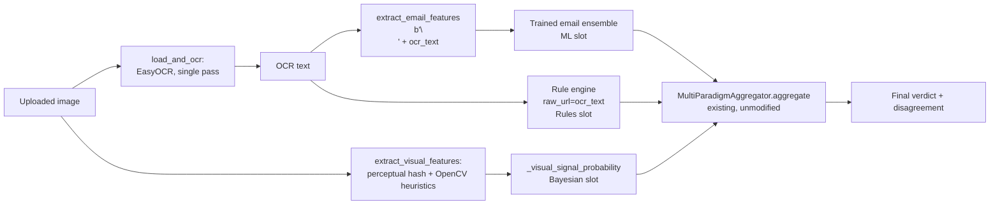

# OCR and Visual Analysis (DOC-06 / DOC-07)

> Source: `src/features/image_features.py`, `src/features/ocr/`
> (`backend.py`, `reference_hashes.py`), `src/api/endpoints.py`
> (`_visual_signal_probability`, `predict_image`); `.planning/ROADMAP.md`
> Phase 7 (INPUT-04, INPUT-06, INPUT-07). See
> [aggregation.md](./aggregation.md) for the `MultiParadigmAggregator` this
> page's combined signal is routed through, and
> [../data-flow.md](../data-flow.md) §"Image/OCR variant" for the request
> sequence.

PhishGuard's image path (`/predict/image`) lets a user submit a screenshot
or photo — of a phishing email, a cloned login page, an SMS screenshot —
rather than raw text or a URL. Delivering this (INPUT-04/06/07) required two
genuinely new techniques not used elsewhere in the project — OCR text
extraction and perceptual-hash/layout visual heuristics — but, consistent
with the project's "reuse rather than reinvent" discipline (see
[aggregation.md](./aggregation.md)), it required **no new classifier and no
new aggregation logic**: the image path feeds its three signals into the
exact same `MultiParadigmAggregator` already documented in
[aggregation.md](./aggregation.md).

## OCR text extraction: EasyOCR

`src/features/ocr/backend.py` defines an `OCRBackend` structural protocol
(`read_text(image) -> str`) with two concrete implementations, selected at
FastAPI startup by `resolve_ocr_backend()`:

- **`NullOCRBackend`** — always returns `""` and logs a warning. Used when
  `easyocr` is not importable, so the application degrades gracefully
  instead of crashing (downstream `TextFeatureExtractor` already handles an
  empty string as all-zero linguistic features).
- **`EasyOCRBackend`** — wraps `easyocr.Reader`, the project's chosen OCR
  engine. `readtext(image, detail=1)` returns a list of `(bbox, text,
  confidence)` tuples; `read_text()` joins only the text spans whose
  confidence exceeds `0.3`, discarding low-confidence noise before any
  downstream feature extraction sees it.

**Dependency isolation** is treated as a hard architectural constraint: both
`easyocr` and `torch` (EasyOCR's deep-learning backend) are imported **only**
inside `EasyOCRBackend._get_reader()`, never at module import time — this is
explicitly so the project's fast unit-test suite can keep running with zero
torch/easyocr installed (the same lazy-import discipline `imagehash` and
`cv2` follow below, and spaCy follows for `TextFeatureExtractor`). The
`easyocr.Reader` model weights are expensive to load (multi-second cold
start); `EasyOCRBackend.warm_up()` forces that load once, and is called from
the FastAPI `lifespan` startup hook (`src/api/main.py`) rather than on the
first request, so per-request latency reflects only inference time, not
model-load time.

EasyOCR's `readtext` does not accept a `PIL.Image` directly — it supports a
file path/URL string, raw bytes, or a numpy array — so `EasyOCRBackend.
_to_ocr_input()` duck-types a PIL image (`hasattr(image, "convert")`) and
converts it to an RGB numpy array before handing it to the reader.

Because OCR inference is inherently slower than the project's other,
purely-numeric feature paths, `/predict/image` is an explicit, documented
exception to the project's general sub-500ms synchronous-endpoint contract
(`src/api/endpoints.py` docstring) — the lifespan warm-up minimizes, but
does not eliminate, this latency cost.

## Perceptual-hash brand similarity

`src/features/ocr/reference_hashes.py::load_reference_hashes()` loads a
committed JSON table (`reference_brand_hashes.json`, built offline by
`assets/brand_logos/build_reference_hashes.py`) mapping brand names to
pre-computed `imagehash.ImageHash` perceptual hashes of known, commonly-
phished brand assets (e.g. login-page screenshots/logos), cached as a
module-level singleton after first load — the same singleton-on-first-use
pattern used for `TextFeatureExtractor` and `EasyOCRBackend`'s reader.

`perceptual_hash_similarity()` (`src/features/image_features.py`) computes
`imagehash.phash(image)` — a perceptual hash robust to minor resizing,
recompression, and color shifts, unlike a cryptographic hash which would
change completely for any pixel difference — for the uploaded image, and its
**Hamming distance** (via `ImageHash.__sub__`, never hand-rolled bit
counting) to every entry in the reference table:

```python
# src/features/image_features.py — perceptual_hash_similarity()
query_hash = imagehash.phash(image)
distances = {brand: query_hash - ref_hash for brand, ref_hash in reference_hashes.items()}
closest_brand = min(distances, key=distances.get)
closest_distance = distances[closest_brand]
```

The closest brand's Hamming distance becomes `visual_hash_distance` (0-64 on
a 64-bit hash — 0 means pixel-perceptually identical to a known reference
image, 64 means maximally different); `visual_brand_similarity_flag` is `1.0`
when `visual_hash_distance <= BRAND_MATCH_THRESHOLD` (currently `10`) and
`0.0` otherwise. `BRAND_MATCH_THRESHOLD = 10` is explicitly documented in
the source as **tunable, not empirically validated** — a commonly-cited
illustrative starting point from `imagehash` tutorials rather than a value
derived against a phishing-specific labeled image dataset in this project
(flagged for future validation once such a dataset exists). The closest-
brand label itself (`closest_brand`) is returned separately from the
numeric feature dict and is not currently fed into the classifier — it is
available for diagnostic/explanation purposes only.

## Visual/layout heuristics (OpenCV)

`_extract_layout_color_features()` computes three further, deliberately
**interpretable, non-ML** heuristics via OpenCV, consistent with the
project's broader interpretability requirement (`.planning/PROJECT.md`):

- **`visual_edge_density`** — fraction of pixels flagged as an edge by
  `cv2.Canny(gray, 100, 200)`. Rationale: form-heavy, button-heavy UIs
  (login-clone pages) tend to exhibit more rectangular structure/edges than
  plain content screenshots.
- **`visual_color_concentration`** — the maximum bin value of a normalized
  3-D (8×8×8) RGB color histogram. Rationale: phishing login clones often
  reuse a narrow brand color palette, so a high concentration in a small
  number of color bins is a weak, heuristic signal.
- **`visual_rect_element_count`** — count of contours from `cv2.findContours`
  (on the Canny edge map) whose `cv2.approxPolyDP` simplification has
  exactly 4 vertices — a rough proxy for the count of rectangular form
  fields/buttons on the page.

Together with the two perceptual-hash features, these make up the
**5 `visual_*` features** (`_VISUAL_FEATURE_KEYS`): `visual_hash_distance`,
`visual_brand_similarity_flag`, `visual_edge_density`,
`visual_color_concentration`, `visual_rect_element_count`.

`extract_visual_features()` **guarantees** this exact 5-key set is returned
regardless of whether `cv2`/`imagehash` are installed — if either import
fails, the corresponding sub-function returns documented default values
(`visual_hash_distance=64.0` — "no similarity, unknown", not a false
"identical"; all others `0.0`) instead of raising. This constant-key-set
invariant is a hard project requirement: a feature vector whose length
varies based on which optional dependencies happen to be installed would
silently break the downstream classifier's fixed input schema, so the
degraded-dependency path and the fully-installed path are made to look
identical to every consumer.

## Combining OCR text + visual signal: no dedicated image classifier

This is the architecturally significant design decision this page exists to
document precisely: **there is no trained image classifier anywhere in
PhishGuard.** `/predict/image` (`src/api/endpoints.py::predict_image`)
produces a verdict entirely by routing its two new signal sources through
the *existing* paradigm slots of the *existing* `MultiParadigmAggregator`
(see [aggregation.md](./aggregation.md)) — exactly as `/predict/multi-
paradigm` does for URLs, with different inputs filling the same three slots:

1. **ML-ensemble slot** — filled by OCR-extracted text, *not* a vision
   model. `load_and_ocr()` runs OCR exactly once on the uploaded image; the
   recognized text is encoded as `b"\n" + ocr_text.encode("utf-8")` and
   passed to `extract_email_features()` — reusing the Phase 6 email/text
   feature pipeline and the trained email ensemble unmodified. The leading
   `b"\n"` is a deliberate parsing trick: it forces the *entire* OCR text to
   be parsed as the RFC-822 email body rather than headers, so a
   colon-containing OCR line such as `"Password: ..."` is preserved as body
   text instead of being misinterpreted as a header field.
2. **Rules slot** — filled by the same expert rule engine used elsewhere
   (see [rule-based-system.md](./rule-based-system.md)), evaluated with
   `raw_url=ocr_text` — i.e., keyword-matching rules run directly against
   the OCR-extracted text. URL-structure-specific rules (domain-pattern
   checks, etc.) simply do not fire, since the relevant URL features are
   absent from an email-schema feature dict (treated as zero) — this is a
   silent no-op, not an error.
3. **Bayesian slot** — filled not by the project's `BayesianClassifier` (see
   [bayesian.md](./bayesian.md)) but by `_visual_signal_probability()`, a
   small hand-authored linear combination of the visual features above:

   ```python
   # src/api/endpoints.py — _visual_signal_probability()
   score = (
       0.7 * visual_brand_similarity_flag
       + 0.15 * min(max(visual_edge_density, 0.0), 1.0)
       + 0.15 * min(max(visual_color_concentration, 0.0), 1.0)
   )
   ```

   The brand-similarity flag dominates (weight `0.7`) because a perceptual
   match to a known-phished brand is the strongest available visual signal;
   edge density and color concentration each contribute a smaller `0.15`
   nudge. `visual_rect_element_count` is deliberately **not** included here
   (an unbounded count would need separate normalization before it could be
   combined linearly with the other, already-`[0,1]`-bounded features) — it
   remains available in the raw feature dict for diagnostic purposes only.
   This weighting, like `BRAND_MATCH_THRESHOLD`, is explicitly documented in
   the source as tunable and not yet empirically validated against a
   labeled phishing-image dataset.

All three results are then passed, unmodified in shape, to `ml_models[
"aggregator"].aggregate(ml_result, rule_result, bayesian_result)` — the
identical `MultiParadigmAggregator.aggregate()` call documented in
[aggregation.md](./aggregation.md), including its weighted combination
(ML=0.5/Rules=0.3/Bayesian=0.2 by default) and its cross-paradigm
disagreement computation. This is the literal mechanism by which OCR text
and visual signal are **combined** into one verdict (`/predict/image`'s
"SC5" requirement in `.planning/ROADMAP.md`): not through a separate fusion
step, but by occupying three of the aggregator's existing input slots.



## Why there is no trained image classifier (and why EVAL-05 reports "N/A")

The absence of a dedicated, trained image/vision classifier is a deliberate,
locked design decision (`src/api/endpoints.py` docstring: "no new
aggregation logic and no new trained image model"), not an oversight — the
image path's novel contribution is OCR text extraction and the
perceptual-hash/visual-heuristic signal, reusing the already-trained
email/text model and rule engine for the actual classification reasoning
rather than training and maintaining a fourth model family end-to-end. One
direct, documented consequence of this decision is visible in the project's
evaluation tooling: the feature-ablation report (EVAL-05,
`src/models/evaluate.py::FEATURE_GROUPS`/`ablate_feature_groups()`) defines
a `"visual"` feature group (the 5 `visual_*` columns), but — because no
trained classifier exists that consumes those columns directly as part of
its learned decision function — the ablation report marks the visual
group's `baseline_accuracy`/`ablated_accuracy`/`delta` cells with a literal
`"N/A"` sentinel string plus an explanatory note, rather than fabricating an
ablation-accuracy number for a classifier that does not exist
(`.planning/phases/10-evaluation-documentation/10-02-SUMMARY.md`: "Visual
group reported as a literal 'N/A' sentinel (not a fabricated number) with an
explanatory note column"). This is a direct, traceable consequence of the
architectural choice documented on this page: the visual signal participates
in the final verdict through the aggregator's hand-authored
`_visual_signal_probability()` weighting, not through a trainable,
ablatable classifier, so "ablate the visual features and re-measure
accuracy" is not a well-defined operation for this path the way it is for
the URL/email/SMS classifiers.
