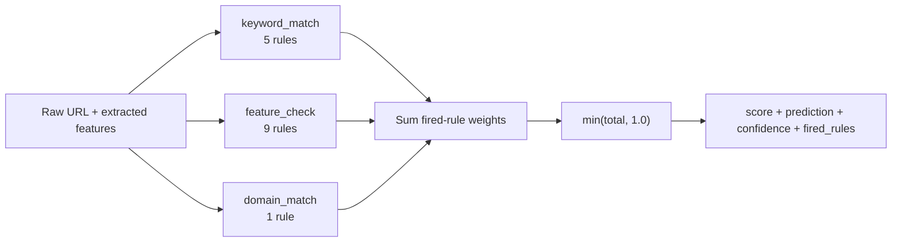

# Rule-Based Expert System (DOC-06 / DOC-07)

> Source: `src/paradigms/rules/` (`engine.py`, `definitions.py`,
> `phishing_rules.yaml`); `.planning/STATE.md` "From 05-01";
> `praca-inzynierska.pdf` §4.5 (measured figures and rule catalog, cited
> for consistency — not reproduced verbatim). See
> [ml-classifiers.md](./ml-classifiers.md) for the statistical-learning
> paradigm this rule engine is deliberately independent from, and
> [ensemble.md](./ensemble.md) for how classifier-level outputs are
> combined. `docs/algorithms/bayesian.md` (this plan, written next) and a
> later `docs/algorithms/aggregation.md` plan (10-06) describe how this
> engine's output is weighted against the ML ensemble and the Bayesian
> classifier at the cross-paradigm level.

## Theory: weighted rule-based expert systems

A rule-based (or "expert") system encodes domain knowledge directly as a
set of human-authored condition-action rules, rather than inferring a
decision boundary statistically from labeled training data. Each rule
captures one discrete piece of heuristic knowledge ("URLs containing an
`@` symbol are often used to disguise the true destination") and
contributes independently to a final decision. In a **weighted** rule
engine — as opposed to a pure Boolean/propositional expert system where
any single fired rule triggers an unconditional verdict — each rule
carries a numeric weight reflecting the strength of the evidence it
represents, and the final score is an aggregate (here, a capped sum) of
the weights of every rule that fired. This design sits philosophically
between classical expert systems (interpretable, but all-or-nothing) and
statistical classifiers (data-driven, but comparatively opaque): a
weighted rule engine stays fully interpretable — every contribution to
the score can be traced back to a named, human-readable condition — while
still producing a graded, threshold-able score rather than a binary
yes/no per rule.

The practical appeal for phishing detection specifically is that the
threat landscape contains well-documented, stable heuristics (IP-address
hosts, URL shorteners, `@`-symbol obfuscation, urgency language) that
security researchers have catalogued for years, independent of any
particular training dataset. A rule engine lets that accumulated
knowledge contribute to a verdict directly, without first needing enough
labeled examples of each specific technique for a statistical model to
learn it — and, because its reasoning is transparent, it provides an
evidence trail a human analyst can audit, which the seven ML classifiers
in [ml-classifiers.md](./ml-classifiers.md) cannot offer individually
(only Decision Tree comes close, and only via its own internal split
path, not via named security heuristics).

## The project's engine: `RuleEngine`

`src/paradigms/rules/engine.py::RuleEngine` loads a versioned rule
catalog from `phishing_rules.yaml`, validates it against a Pydantic
schema (`definitions.py`), and exposes a single evaluation entry point,
`evaluate(features, raw_url=None)`, that scores a URL against every
loaded rule and returns a structured, explainable result.

### Rule catalog: 16 weighted rules across 4 categories

`phishing_rules.yaml` (version `"1.0.0"`) defines exactly 16 rules,
organized into four categories:

| Category | Rule count | Rules | Example weight |
|---|---|---|---|
| URL structure | 4 | `ip_address_host`, `shortened_url`, `excessive_subdomains`, `suspicious_tld` | `ip_address_host` = 0.35 (highest single weight) |
| Keywords | 5 | `urgent_keywords`, `security_keywords`, `action_keywords`, `brand_impersonation`, `threat_keywords` | `brand_impersonation` = 0.25 |
| Structure indicators | 4 | `long_url`, `many_special_chars`, `high_entropy`, `deep_path` | `high_entropy` = 0.15 |
| Domain indicators | 3 | `no_https`, `port_in_url`, `at_symbol` | `at_symbol` = 0.30 |

Each rule's `weight` is a project-level estimate of how strongly that
single signal, in isolation, correlates with phishing intent — derived
from security-literature consensus and the project's own exploratory data
analysis of the training set, not learned from gradient descent. The
**sum of all 16 weights is 3.05** (`.planning/STATE.md` "From 05-01"),
deliberately well above 1.0: because most phishing URLs trigger only a
handful of the 16 rules at once (not all 16 simultaneously), a raw weight
sum calibrated to "all rules fire ⇒ score 1.0" would make any single
real-world sample's score far too small to be useful. `RuleSet`'s
Pydantic validator (`definitions.py::validate_total_weight`) emits a
`UserWarning` if the catalog's total weight ever exceeds 2.0, flagging
potential redundancy between overlapping rules before the catalog grows
uncontrolled — 3.05 is an intentional, acknowledged exception to that
soft ceiling, made deliberately because the aggregate score is normalized
downstream (see below), not left as a raw sum.

### Three condition types

Every rule's `condition` is one of three Pydantic-validated types
(`RuleCondition.type: Literal['keyword_match', 'feature_check',
'domain_match']`), each with its own evaluator method on `RuleEngine`:

**`keyword_match`** (`_evaluate_keyword_match`) checks whether any string
in `condition.keywords` appears as a case-insensitive substring of the
**raw URL string**, not the extracted feature dict. This is why
`RuleEngine.evaluate()` accepts `raw_url` as a separate parameter from
`features` — keyword matching needs the literal URL text (e.g. to find
`"paypal"` inside `http://paypal-secure-login.tk/verify`), which the
30-numeric-feature extraction deliberately discards. Five of the 16 rules
use this condition type (`urgent_keywords`, `security_keywords`,
`action_keywords`, `brand_impersonation`, `threat_keywords`), together
covering urgency/pressure language, security-themed terms,
credential-related action words, brand-name impersonation, and
account-threat phrasing.

**`feature_check`** (`_evaluate_feature_check`) compares one named
numeric feature from the `extract_url_features()` output against a
threshold `value`, using one of four operators: `equals`,
`greater_than`, `less_than`, or `contains` (the last for string-typed
features). For example, `ip_address_host` fires when `has_ip == 1`, and
`high_entropy` fires when `entropy > 4.5`. This is the most common
condition type in the catalog (9 of 16 rules), spanning the URL structure,
structure-indicator, and domain-indicator categories.

**`domain_match`** (`_evaluate_domain_match`) checks whether the raw URL
contains any domain from a known list — currently used for one rule,
`shortened_url`, which matches against a hard-coded list of 7 common URL
shortening services (`bit.ly`, `tinyurl.com`, `goo.gl`, `t.co`, `ow.ly`,
`is.gd`, `buff.ly`). Like `keyword_match`, this evaluator operates on the
raw URL string rather than the numeric feature dict, for the same reason:
a shortener's domain is a textual property, not something the 30-feature
numeric extraction encodes directly.

### Score aggregation: `min(total, 1.0)` normalization

`RuleEngine.evaluate()` iterates every rule in the catalog, evaluates its
condition via the appropriate `_evaluate_*` method, and — for every rule
that fires — adds its `weight` to a running `total_score` and appends a
structured record (`name`, `description`, `weight`, `category`,
`matched_values`) to `fired_rules`. Once every rule has been checked, the
raw `total_score` (which, in principle, could reach as high as 3.05 if
every rule fired simultaneously) is capped with
`normalized_score = min(total_score, 1.0)`. This is a deliberately simple
normalization — not a sigmoid, not a softmax, not a learned scaling
function — chosen precisely because it preserves direct interpretability:
a score of exactly `1.0` means "the fired rules' weights alone already
exceed full confidence," while any score strictly between 0 and 1 is the
literal, unmodified sum of the weights of the rules that fired, with no
hidden transformation to reverse-engineer when explaining a verdict to an
analyst.

```python
# src/paradigms/rules/engine.py — RuleEngine.evaluate()
for rule in self.ruleset.rules:
    result = self._evaluate_rule(rule, features, raw_url)
    if result['fired']:
        fired_rules.append({...})
        total_score += rule.weight

normalized_score = min(total_score, 1.0)
prediction = 'phishing' if normalized_score >= 0.5 else 'legitimate'
confidence = abs(normalized_score - 0.5)
```

The binary `prediction` is thresholded at `0.5` (consistent with every
other paradigm in this project — the ML ensemble, the Bayesian classifier,
and cross-paradigm aggregation all use the same 0.5 decision boundary on
a `[0, 1]`-scaled score), and `confidence` is reported as the normalized
score's distance from that threshold (`0.0` at the boundary, up to `0.5`
at either extreme) — the same "distance from 0.5" confidence convention
used by the Bayesian classifier's `predict_with_posterior()` (see
`docs/algorithms/bayesian.md`, written next).

### Pydantic rule validation

`definitions.py` defines three Pydantic v2 models: `RuleCondition`
(validates condition fields are consistent with the declared `type`, and
that `keywords`/`domains` lists are non-empty when provided),
`PhishingRule` (validates `weight` is in `[0.0, 1.0]` and `name` is
lowercase snake_case), and `RuleSet` (validates the overall catalog,
including the `>2.0` total-weight redundancy warning described above).
Loading an invalid YAML catalog — a malformed condition, an
out-of-range weight, a non-snake-case rule name — raises a
`pydantic.ValidationError` at `RuleEngine.__init__()` time, before any
URL is ever evaluated: schema errors in the rule catalog fail fast at
engine construction, not silently at evaluation time on whichever
request happens to touch the broken rule.

### Fired-rules-with-justification output

`RuleEngine.evaluate()`'s return value is not just a score — it is
designed as a self-contained explanation object:

```python
{
    'score': 0.60,                 # normalized_score, [0, 1]
    'prediction': 'phishing',      # thresholded at 0.5
    'confidence': 0.10,            # |score - 0.5|
    'fired_rules': [               # every rule that fired, with justification
        {
            'name': 'suspicious_tld',
            'description': 'URL uses suspicious top-level domain ...',
            'weight': 0.25,
            'category': 'url_structure',
            'matched_values': ['has_suspicious_tld=1'],
        },
        {
            'name': 'urgent_keywords',
            'description': 'URL contains urgent/pressure keywords',
            'weight': 0.20,
            'category': 'keywords',
            'matched_values': ['verify'],
        },
    ],
    'rule_count': 2,                # len(fired_rules)
    'max_possible_score': 3.05,     # sum of all 16 rule weights, unnormalized
}
```

Every element of `fired_rules` carries enough information to reconstruct
*why* the score is what it is — which named heuristic fired, in which
category, at what weight, and which specific keyword/feature value/domain
triggered it (`matched_values`). This is the rule engine's principal
advantage over a purely statistical classifier: an analyst reviewing a
flagged URL does not need SHAP values or any post-hoc explainability
technique (see a later `docs/algorithms/explainability.md` plan) to
understand the rule engine's reasoning — the explanation *is* the engine's
native output format, by construction.



## Cross-paradigm role

Within the broader multi-paradigm architecture, this rule engine is
computationally cheap (no model inference, just condition evaluation over
a dict and a string) and deliberately independent of the statistical
learning paradigm in [ml-classifiers.md](./ml-classifiers.md) and
[ensemble.md](./ensemble.md): its score comes from hand-authored domain
knowledge, not from patterns learned from the training distribution. This
independence is exactly what the cross-paradigm aggregator (a later
`docs/algorithms/aggregation.md` plan, 10-06) exploits — when the rule
engine's score and the ML ensemble's probability disagree sharply, that
disagreement is itself a diagnostic signal (the project's stated core
thesis), because the two paradigms are reasoning from fundamentally
different evidence.
