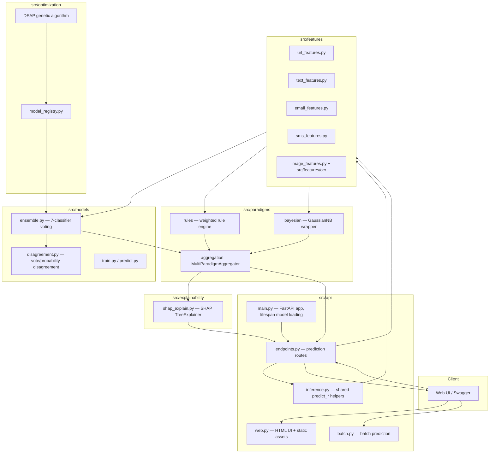

# System Architecture (DOC-04)

PhishGuard is a multi-paradigm phishing-detection system: a FastAPI backend
serves predictions for four content types (URL, email, SMS, image) by
combining a 7-classifier ML ensemble, a weighted rule engine, and a
Bayesian probabilistic classifier through a shared aggregator, with SHAP
explainability and a web UI layered on top.

This document describes the system's static component structure. For the
request-time sequence of calls, see [data-flow.md](./data-flow.md). For how
to explore the live API, see [api.md](./api.md).

## Component diagram

## Subpackage responsibilities

- **`src/api`** — FastAPI application. `main.py` builds the `app`, loads all
  models once at startup via a `lifespan` context manager (never per
  request, to keep latency sub-500ms), and applies security headers.
  `endpoints.py` holds the ten prediction/info/health routes. `web.py`
  serves the HTML dashboard and static assets (Phase 8). `batch.py` runs
  batch predictions over multiple inputs. `inference.py` centralizes the
  `predict_url_multi` / `predict_email_text` / `predict_sms_text` helpers
  shared between the API routes and the batch runner.
- **`src/features`** — Pure feature-extraction functions, one module per
  content type: 30 URL features, shared NLP text features (lexical,
  syntactic, stylometric, sentiment) reused by both email and SMS, 15
  email-header features, 20 SMS-specific features, and 5 visual/structural
  features from `image_features.py` plus the EasyOCR wrapper in
  `src/features/ocr/`. No feature module depends on a trained model — this
  is a one-way boundary from raw input to numeric feature dict.
- **`src/paradigms`** — The three non-ML-ensemble reasoning paradigms:
  `rules` (a YAML-configured weighted rule engine), `bayesian` (a
  `GaussianNB` wrapper exposing posterior probabilities), and `aggregation`
  (`MultiParadigmAggregator`, which combines ML-ensemble + rules + Bayesian
  outputs into one verdict and computes the cross-paradigm disagreement
  score — the thesis's core diagnostic signal).
- **`src/models`** — The 7-classifier voting ensemble (RF, SVM, MLP,
  XGBoost, LogReg, NaiveBayes, DecisionTree), training/prediction entry
  points, and `disagreement.py`, which measures inter-classifier vote and
  probability spread independently of the cross-paradigm disagreement
  computed in `aggregation`.
- **`src/optimization`** — DEAP-based genetic-algorithm hyperparameter
  optimization and the `model_registry`, which tracks which trained model
  artifact is "active" so the API lifespan loader always picks up the
  GA-optimized version when available, falling back to the baseline
  otherwise.
- **`src/explainability`** — SHAP `TreeExplainer` wrapper, warmed once at
  startup (same rationale as model loading) and invoked on demand from the
  `/explain` endpoint, never on the fast `/predict*` path.

## Content-type routing

All four content types (URL, email, SMS, image) converge on the same
paradigm layer. For image input, OCR-extracted text is fed into the
existing email/text feature pipeline (no separate trained image
classifier exists) while a visual brand-similarity/layout heuristic fills
the aggregator's third input slot in place of the Bayesian classifier.
Theoretical descriptions of each algorithm, including OCR/visual, are
planned for a future `docs/algorithms/` set (not part of this plan).
