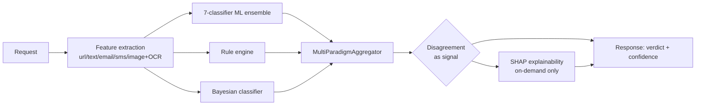
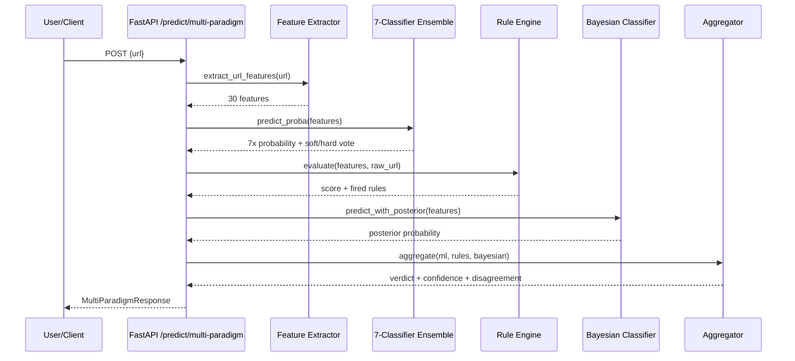

# Data Flow (DOC-05)

This document describes how a single request flows through PhishGuard at
runtime. See [architecture.md](./architecture.md) for the static component
structure these diagrams reference, and [api.md](./api.md) for the route
reference.

## Classification pipeline

The following flow applies to every content type (URL/email/SMS/image),
with content-type-specific feature extraction feeding the same
paradigm → aggregation → explainability chain:

The disagreement step is not a side effect — it is a first-class output
computed by the aggregator from the three paradigm verdicts and surfaced in
every multi-paradigm response (`disagreement.score`,
`disagreement.is_edge_case`, `disagreement.disagreeing_paradigms`). SHAP
explanation is only computed when `/explain` is called, never inline on the
fast prediction paths, to keep `/predict*` latency low.

## `/predict/multi-paradigm` request sequence

The sequence below documents `/predict/multi-paradigm` specifically, since
it is the endpoint that exercises all three paradigms together and is the
thesis's core-value demonstration:

## Image/OCR variant

`/predict/image` follows the same pipeline shape but with a different
source for each paradigm slot: OCR-extracted text (via a single
`load_and_ocr` pass) fills the ML-ensemble slot (reusing the trained
email/text model), rule-engine keyword matching runs against the OCR text
directly, and a perceptual-hash brand-similarity/layout heuristic fills the
Bayesian slot — all three are combined through the same
`MultiParadigmAggregator` used by `/predict/multi-paradigm`, so no new
aggregation logic exists for images.
